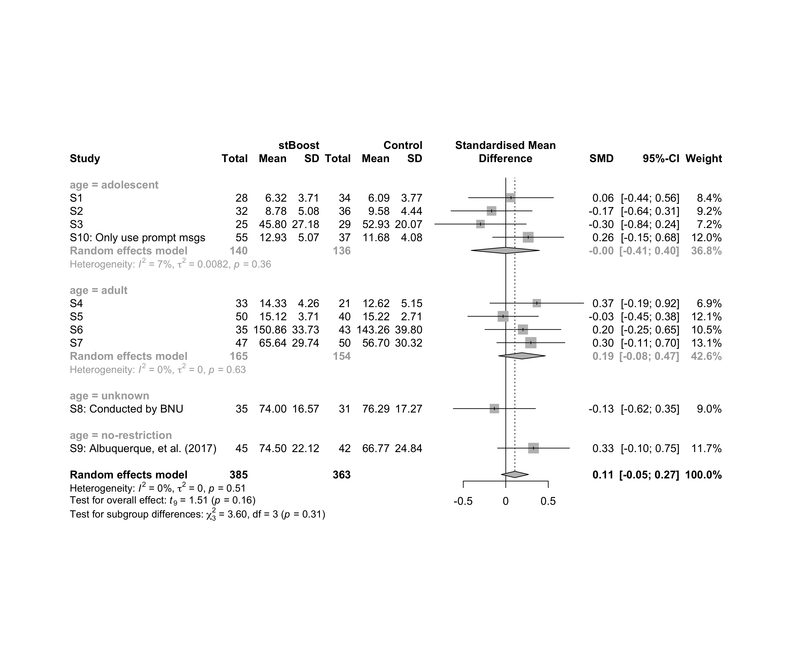

Metanalysis of performance in condition of Stereotype Boost (`stBoost`)
================
Geiser C. Challco <geiser@alumni.usp.br>

-   [Initial Variables and Loading
    Data](#initial-variables-and-loading-data)
-   [Perform meta-analyses](#perform-meta-analyses)
    -   [Subgroup analysis by “country”](#subgroup-analysis-by-country)
    -   [Subgroup analysis by “age”](#subgroup-analysis-by-age)
    -   [Subgroup analysis by “ed.level”](#subgroup-analysis-by-edlevel)
    -   [Subgroup analysis by
        “intervention”](#subgroup-analysis-by-intervention)
    -   [Subgroup analysis by
        “country:age”](#subgroup-analysis-by-countryage)
    -   [Subgroup analysis by
        “country:ed.level”](#subgroup-analysis-by-countryedlevel)
    -   [Subgroup analysis by
        “country:intervention”](#subgroup-analysis-by-countryintervention)
    -   [Subgroup analysis by
        “age:intervention”](#subgroup-analysis-by-ageintervention)
    -   [Subgroup analysis by
        “ed.level:intervention”](#subgroup-analysis-by-edlevelintervention)
    -   [Subgroup analysis by
        “country:age:intervention”](#subgroup-analysis-by-countryageintervention)
    -   [Subgroup analysis by
        “country:ed.level:intervention”](#subgroup-analysis-by-countryedlevelintervention)
-   [Funnel Plot](#funnel-plot)

## Initial Variables and Loading Data

``` r
cond <- "stBoost"
to_remove <- c('S11')
sub.groups <- c("country","age","ed.level","intervention",
                "country:age","country:ed.level","country:intervention",
                "age:intervention","ed.level:intervention",
                "country:age:intervention","country:ed.level:intervention")
```

``` r
dat <- read_excel("../data/data-without-outliers.xlsx", sheet = "perform-cond-descriptive")
dat <- dat[!dat$study %in% to_remove, ]

leg <- read_excel("../data/data-without-outliers.xlsx", sheet = "legend")
```

    ## New names:
    ## • `` -> `...10`

``` r
leg <- leg[!leg$study %in% to_remove, ]

idx.e <- which(dat$condition==cond)
idx.c <- which(dat$condition=="control")

data <- data.frame(
  study = dat$study[idx.c],
  n.e = dat$N[idx.e], mean.e = dat$M[idx.e], sd.e = dat$SD[idx.e],
  n.c = dat$N[idx.c], mean.c = dat$M[idx.c], sd.c = dat$SD[idx.c]
)
for (cgroups in strsplit(sub.groups,":")) {
  data[[paste0(cgroups, collapse = ":")]] <- sapply(data$study, FUN = function(x) {
    paste0(sapply(cgroups, FUN = function(namecol) leg[[namecol]][which(x == leg$study)]), collapse = ":")
  })
}
data[["lbl"]] <- sapply(data$study, FUN = function(x) leg$Note[which(x == leg$study)])
```

## Perform meta-analyses

``` r
m.cont <- metacont(
  n.e = n.e, mean.e = mean.e, sd.e = sd.e, n.c = n.c, mean.c = mean.c, sd.c = sd.c,
  studlab = lbl, data = data, sm = "SMD", method.smd = "Hedges",
  fixed = F, random = T, method.tau = "REML", hakn = T, title = paste("Performance in",cond)
)
summary(m.cont)
```

    ## Review:     Performance in stBoost
    ## 
    ##                                    SMD            95%-CI %W(random)
    ## S1                              0.0615 [-0.4388; 0.5618]        8.4
    ## S2                             -0.1670 [-0.6440; 0.3101]        9.2
    ## S3                             -0.2975 [-0.8356; 0.2405]        7.2
    ## S4                              0.3656 [-0.1862; 0.9173]        6.9
    ## S5                             -0.0315 [-0.4473; 0.3843]       12.1
    ## S6                              0.2023 [-0.2451; 0.6496]       10.5
    ## S7                              0.2952 [-0.1052; 0.6957]       13.1
    ## S8: Conducted by BNU           -0.1339 [-0.6179; 0.3501]        9.0
    ## S9: Albuquerque, et al. (2017)  0.3264 [-0.0970; 0.7498]       11.7
    ## S10: Only use prompt msgs       0.2641 [-0.1544; 0.6827]       12.0
    ## 
    ## Number of studies combined: k = 10
    ## Number of observations: o = 748
    ## 
    ##                         SMD            95%-CI    t p-value
    ## Random effects model 0.1071 [-0.0532; 0.2675] 1.51  0.1649
    ## 
    ## Quantifying heterogeneity:
    ##  tau^2 = 0 [0.0000; 0.1227]; tau = 0 [0.0000; 0.3502]
    ##  I^2 = 0.0% [0.0%; 62.4%]; H = 1.00 [1.00; 1.63]
    ## 
    ## Test of heterogeneity:
    ##     Q d.f. p-value
    ##  8.29    9  0.5055
    ## 
    ## Details on meta-analytical method:
    ## - Inverse variance method
    ## - Restricted maximum-likelihood estimator for tau^2
    ## - Q-profile method for confidence interval of tau^2 and tau
    ## - Hartung-Knapp adjustment for random effects model
    ## - Hedges' g (bias corrected standardised mean difference; using exact formulae)

``` r
forest(m.cont, digits=2, digits.sd = 2, test.overall = T, label.e = cond)
```

<!-- -->

### Subgroup analysis by “country”

``` r
m.sg4sub <- update.meta(m.cont, subgroup = country, random = T, fixed = F)
summary(m.sg4sub)
```

    ## Review:     Performance in stBoost
    ## 
    ##                                    SMD            95%-CI %W(random) country
    ## S1                              0.0615 [-0.4388; 0.5618]        8.4  Brazil
    ## S2                             -0.1670 [-0.6440; 0.3101]        9.2  Brazil
    ## S3                             -0.2975 [-0.8356; 0.2405]        7.2  Brazil
    ## S4                              0.3656 [-0.1862; 0.9173]        6.9  Brazil
    ## S5                             -0.0315 [-0.4473; 0.3843]       12.1  Brazil
    ## S6                              0.2023 [-0.2451; 0.6496]       10.5  Brazil
    ## S7                              0.2952 [-0.1052; 0.6957]       13.1  Brazil
    ## S8: Conducted by BNU           -0.1339 [-0.6179; 0.3501]        9.0   China
    ## S9: Albuquerque, et al. (2017)  0.3264 [-0.0970; 0.7498]       11.7  Brazil
    ## S10: Only use prompt msgs       0.2641 [-0.1544; 0.6827]       12.0  Brazil
    ## 
    ## Number of studies combined: k = 10
    ## Number of observations: o = 748
    ## 
    ##                         SMD            95%-CI    t p-value
    ## Random effects model 0.1071 [-0.0532; 0.2675] 1.51  0.1649
    ## 
    ## Quantifying heterogeneity:
    ##  tau^2 = 0 [0.0000; 0.1227]; tau = 0 [0.0000; 0.3502]
    ##  I^2 = 0.0% [0.0%; 62.4%]; H = 1.00 [1.00; 1.63]
    ## 
    ## Test of heterogeneity:
    ##     Q d.f. p-value
    ##  8.29    9  0.5055
    ## 
    ## Results for subgroups (random effects model):
    ##                    k     SMD            95%-CI tau^2 tau    Q  I^2
    ## country = Brazil   9  0.1308 [-0.0390; 0.3007]     0   0 7.24 0.0%
    ## country = China    1 -0.1339 [-0.6179; 0.3501]    --  -- 0.00   --
    ## 
    ## Test for subgroup differences (random effects model):
    ##                     Q d.f. p-value
    ## Between groups   1.06    1  0.3042
    ## 
    ## Details on meta-analytical method:
    ## - Inverse variance method
    ## - Restricted maximum-likelihood estimator for tau^2
    ## - Q-profile method for confidence interval of tau^2 and tau
    ## - Hartung-Knapp adjustment for random effects model
    ## - Hedges' g (bias corrected standardised mean difference; using exact formulae)

``` r
forest(m.sg4sub, digits=2, digits.sd = 2, test.overall = T, label.e = cond)
```

<!-- -->

### Subgroup analysis by “age”

``` r
m.sg4sub <- update.meta(m.cont, subgroup = country, random = T, fixed = F)
summary(m.sg4sub)
```

    ## Review:     Performance in stBoost
    ## 
    ##                                    SMD            95%-CI %W(random) country
    ## S1                              0.0615 [-0.4388; 0.5618]        8.4  Brazil
    ## S2                             -0.1670 [-0.6440; 0.3101]        9.2  Brazil
    ## S3                             -0.2975 [-0.8356; 0.2405]        7.2  Brazil
    ## S4                              0.3656 [-0.1862; 0.9173]        6.9  Brazil
    ## S5                             -0.0315 [-0.4473; 0.3843]       12.1  Brazil
    ## S6                              0.2023 [-0.2451; 0.6496]       10.5  Brazil
    ## S7                              0.2952 [-0.1052; 0.6957]       13.1  Brazil
    ## S8: Conducted by BNU           -0.1339 [-0.6179; 0.3501]        9.0   China
    ## S9: Albuquerque, et al. (2017)  0.3264 [-0.0970; 0.7498]       11.7  Brazil
    ## S10: Only use prompt msgs       0.2641 [-0.1544; 0.6827]       12.0  Brazil
    ## 
    ## Number of studies combined: k = 10
    ## Number of observations: o = 748
    ## 
    ##                         SMD            95%-CI    t p-value
    ## Random effects model 0.1071 [-0.0532; 0.2675] 1.51  0.1649
    ## 
    ## Quantifying heterogeneity:
    ##  tau^2 = 0 [0.0000; 0.1227]; tau = 0 [0.0000; 0.3502]
    ##  I^2 = 0.0% [0.0%; 62.4%]; H = 1.00 [1.00; 1.63]
    ## 
    ## Test of heterogeneity:
    ##     Q d.f. p-value
    ##  8.29    9  0.5055
    ## 
    ## Results for subgroups (random effects model):
    ##                    k     SMD            95%-CI tau^2 tau    Q  I^2
    ## country = Brazil   9  0.1308 [-0.0390; 0.3007]     0   0 7.24 0.0%
    ## country = China    1 -0.1339 [-0.6179; 0.3501]    --  -- 0.00   --
    ## 
    ## Test for subgroup differences (random effects model):
    ##                     Q d.f. p-value
    ## Between groups   1.06    1  0.3042
    ## 
    ## Details on meta-analytical method:
    ## - Inverse variance method
    ## - Restricted maximum-likelihood estimator for tau^2
    ## - Q-profile method for confidence interval of tau^2 and tau
    ## - Hartung-Knapp adjustment for random effects model
    ## - Hedges' g (bias corrected standardised mean difference; using exact formulae)

``` r
forest(m.sg4sub, digits=2, digits.sd = 2, test.overall = T, label.e = cond)
```

<!-- -->

### Subgroup analysis by “ed.level”

``` r
m.sg4sub <- update.meta(m.cont, subgroup = ed.level, random = T, fixed = F)
summary(m.sg4sub)
```

    ## Review:     Performance in stBoost
    ## 
    ##                                    SMD            95%-CI %W(random)         ed.level
    ## S1                              0.0615 [-0.4388; 0.5618]        8.4  upper-secundary
    ## S2                             -0.1670 [-0.6440; 0.3101]        9.2  upper-secundary
    ## S3                             -0.2975 [-0.8356; 0.2405]        7.2  upper-secundary
    ## S4                              0.3656 [-0.1862; 0.9173]        6.9 higher-education
    ## S5                             -0.0315 [-0.4473; 0.3843]       12.1 higher-education
    ## S6                              0.2023 [-0.2451; 0.6496]       10.5 higher-education
    ## S7                              0.2952 [-0.1052; 0.6957]       13.1          unknown
    ## S8: Conducted by BNU           -0.1339 [-0.6179; 0.3501]        9.0          unknown
    ## S9: Albuquerque, et al. (2017)  0.3264 [-0.0970; 0.7498]       11.7          unknown
    ## S10: Only use prompt msgs       0.2641 [-0.1544; 0.6827]       12.0  upper-secundary
    ## 
    ## Number of studies combined: k = 10
    ## Number of observations: o = 748
    ## 
    ##                         SMD            95%-CI    t p-value
    ## Random effects model 0.1071 [-0.0532; 0.2675] 1.51  0.1649
    ## 
    ## Quantifying heterogeneity:
    ##  tau^2 = 0 [0.0000; 0.1227]; tau = 0 [0.0000; 0.3502]
    ##  I^2 = 0.0% [0.0%; 62.4%]; H = 1.00 [1.00; 1.63]
    ## 
    ## Test of heterogeneity:
    ##     Q d.f. p-value
    ##  8.29    9  0.5055
    ## 
    ## Results for subgroups (random effects model):
    ##                               k     SMD            95%-CI  tau^2    tau    Q   I^2
    ## ed.level = upper-secundary    4 -0.0049 [-0.4065; 0.3967] 0.0082 0.0905 3.23  7.2%
    ## ed.level = higher-education   3  0.1443 [-0.3400; 0.6285]      0      0 1.37  0.0%
    ## ed.level = unknown            3  0.1903 [-0.4104; 0.7910] 0.0036 0.0599 2.38 16.1%
    ## 
    ## Test for subgroup differences (random effects model):
    ##                     Q d.f. p-value
    ## Between groups   1.25    2  0.5347
    ## 
    ## Details on meta-analytical method:
    ## - Inverse variance method
    ## - Restricted maximum-likelihood estimator for tau^2
    ## - Q-profile method for confidence interval of tau^2 and tau
    ## - Hartung-Knapp adjustment for random effects model
    ## - Hedges' g (bias corrected standardised mean difference; using exact formulae)

``` r
forest(m.sg4sub, digits=2, digits.sd = 2, test.overall = T, label.e = cond)
```

<!-- -->

### Subgroup analysis by “intervention”

``` r
m.sg4sub <- update.meta(m.cont, subgroup = `intervention`, random = T, fixed = F)
summary(m.sg4sub)
```

    ## Review:     Performance in stBoost
    ## 
    ##                                    SMD            95%-CI %W(random)
    ## S1                              0.0615 [-0.4388; 0.5618]        8.4
    ## S2                             -0.1670 [-0.6440; 0.3101]        9.2
    ## S3                             -0.2975 [-0.8356; 0.2405]        7.2
    ## S4                              0.3656 [-0.1862; 0.9173]        6.9
    ## S5                             -0.0315 [-0.4473; 0.3843]       12.1
    ## S6                              0.2023 [-0.2451; 0.6496]       10.5
    ## S7                              0.2952 [-0.1052; 0.6957]       13.1
    ## S8: Conducted by BNU           -0.1339 [-0.6179; 0.3501]        9.0
    ## S9: Albuquerque, et al. (2017)  0.3264 [-0.0970; 0.7498]       11.7
    ## S10: Only use prompt msgs       0.2641 [-0.1544; 0.6827]       12.0
    ##                                                                        intervention
    ## S1                             Gender-stereotype color, ranking, badges, and avatar
    ## S2                             Gender-stereotype color, ranking, badges, and avatar
    ## S3                             Gender-stereotype color, ranking, badges, and avatar
    ## S4                             Gender-stereotype color, ranking, badges, and avatar
    ## S5                             Gender-stereotype color, ranking, badges, and avatar
    ## S6                             Gender-stereotype color, ranking, badges, and avatar
    ## S7                             Gender-stereotype color, ranking, badges, and avatar
    ## S8: Conducted by BNU           Gender-stereotype color, ranking, badges, and avatar
    ## S9: Albuquerque, et al. (2017) Gender-stereotype color, ranking, badges, and avatar
    ## S10: Only use prompt msgs           Gender-stereotyped motivational message prompts
    ## 
    ## Number of studies combined: k = 10
    ## Number of observations: o = 748
    ## 
    ##                         SMD            95%-CI    t p-value
    ## Random effects model 0.1071 [-0.0532; 0.2675] 1.51  0.1649
    ## 
    ## Quantifying heterogeneity:
    ##  tau^2 = 0 [0.0000; 0.1227]; tau = 0 [0.0000; 0.3502]
    ##  I^2 = 0.0% [0.0%; 62.4%]; H = 1.00 [1.00; 1.63]
    ## 
    ## Test of heterogeneity:
    ##     Q d.f. p-value
    ##  8.29    9  0.5055
    ## 
    ## Results for subgroups (random effects model):
    ##                                                      k    SMD            95%-CI tau^2 tau    Q  I^2
    ## intervention = Gender-stereotype color, rankin ...   9 0.0858 [-0.0920; 0.2636]     0   0 7.67 0.0%
    ## intervention = Gender-stereotyped motivational ...   1 0.2641 [-0.1544; 0.6827]    --  -- 0.00   --
    ## 
    ## Test for subgroup differences (random effects model):
    ##                     Q d.f. p-value
    ## Between groups   0.62    1  0.4323
    ## 
    ## Details on meta-analytical method:
    ## - Inverse variance method
    ## - Restricted maximum-likelihood estimator for tau^2
    ## - Q-profile method for confidence interval of tau^2 and tau
    ## - Hartung-Knapp adjustment for random effects model
    ## - Hedges' g (bias corrected standardised mean difference; using exact formulae)

``` r
forest(m.sg4sub, digits=2, digits.sd = 2, test.overall = T, label.e = cond)
```

<!-- -->

### Subgroup analysis by “country:age”

``` r
m.sg4sub <- update.meta(m.cont, subgroup = `country:age`, random = T, fixed = F)
summary(m.sg4sub)
```

    ## Review:     Performance in stBoost
    ## 
    ##                                    SMD            95%-CI %W(random)           country:age
    ## S1                              0.0615 [-0.4388; 0.5618]        8.4     Brazil:adolescent
    ## S2                             -0.1670 [-0.6440; 0.3101]        9.2     Brazil:adolescent
    ## S3                             -0.2975 [-0.8356; 0.2405]        7.2     Brazil:adolescent
    ## S4                              0.3656 [-0.1862; 0.9173]        6.9          Brazil:adult
    ## S5                             -0.0315 [-0.4473; 0.3843]       12.1          Brazil:adult
    ## S6                              0.2023 [-0.2451; 0.6496]       10.5          Brazil:adult
    ## S7                              0.2952 [-0.1052; 0.6957]       13.1          Brazil:adult
    ## S8: Conducted by BNU           -0.1339 [-0.6179; 0.3501]        9.0  China:no-restriction
    ## S9: Albuquerque, et al. (2017)  0.3264 [-0.0970; 0.7498]       11.7 Brazil:no-restriction
    ## S10: Only use prompt msgs       0.2641 [-0.1544; 0.6827]       12.0    Brazil:adolescence
    ## 
    ## Number of studies combined: k = 10
    ## Number of observations: o = 748
    ## 
    ##                         SMD            95%-CI    t p-value
    ## Random effects model 0.1071 [-0.0532; 0.2675] 1.51  0.1649
    ## 
    ## Quantifying heterogeneity:
    ##  tau^2 = 0 [0.0000; 0.1227]; tau = 0 [0.0000; 0.3502]
    ##  I^2 = 0.0% [0.0%; 62.4%]; H = 1.00 [1.00; 1.63]
    ## 
    ## Test of heterogeneity:
    ##     Q d.f. p-value
    ##  8.29    9  0.5055
    ## 
    ## Results for subgroups (random effects model):
    ##                                       k     SMD            95%-CI tau^2 tau    Q  I^2
    ## country:age = Brazil:adolescent       3 -0.1280 [-0.5695; 0.3135]     0   0 0.96 0.0%
    ## country:age = Brazil:adult            4  0.1906 [-0.0844; 0.4656]     0   0 1.75 0.0%
    ## country:age = China:no-restriction    1 -0.1339 [-0.6179; 0.3501]    --  -- 0.00   --
    ## country:age = Brazil:no-restriction   1  0.3264 [-0.0970; 0.7498]    --  -- 0.00   --
    ## country:age = Brazil:adolescence      1  0.2641 [-0.1544; 0.6827]    --  -- 0.00   --
    ## 
    ## Test for subgroup differences (random effects model):
    ##                     Q d.f. p-value
    ## Between groups   8.54    4  0.0737
    ## 
    ## Details on meta-analytical method:
    ## - Inverse variance method
    ## - Restricted maximum-likelihood estimator for tau^2
    ## - Q-profile method for confidence interval of tau^2 and tau
    ## - Hartung-Knapp adjustment for random effects model
    ## - Hedges' g (bias corrected standardised mean difference; using exact formulae)

``` r
forest(m.sg4sub, digits=2, digits.sd = 2, test.overall = T, label.e = cond)
```

<!-- -->

### Subgroup analysis by “country:ed.level”

``` r
m.sg4sub <- update.meta(m.cont, subgroup = `country:ed.level`, random = T, fixed = F)
summary(m.sg4sub)
```

    ## Review:     Performance in stBoost
    ## 
    ##                                    SMD            95%-CI %W(random)        country:ed.level
    ## S1                              0.0615 [-0.4388; 0.5618]        8.4  Brazil:upper-secundary
    ## S2                             -0.1670 [-0.6440; 0.3101]        9.2  Brazil:upper-secundary
    ## S3                             -0.2975 [-0.8356; 0.2405]        7.2  Brazil:upper-secundary
    ## S4                              0.3656 [-0.1862; 0.9173]        6.9 Brazil:higher-education
    ## S5                             -0.0315 [-0.4473; 0.3843]       12.1 Brazil:higher-education
    ## S6                              0.2023 [-0.2451; 0.6496]       10.5 Brazil:higher-education
    ## S7                              0.2952 [-0.1052; 0.6957]       13.1          Brazil:unknown
    ## S8: Conducted by BNU           -0.1339 [-0.6179; 0.3501]        9.0           China:unknown
    ## S9: Albuquerque, et al. (2017)  0.3264 [-0.0970; 0.7498]       11.7          Brazil:unknown
    ## S10: Only use prompt msgs       0.2641 [-0.1544; 0.6827]       12.0  Brazil:upper-secundary
    ## 
    ## Number of studies combined: k = 10
    ## Number of observations: o = 748
    ## 
    ##                         SMD            95%-CI    t p-value
    ## Random effects model 0.1071 [-0.0532; 0.2675] 1.51  0.1649
    ## 
    ## Quantifying heterogeneity:
    ##  tau^2 = 0 [0.0000; 0.1227]; tau = 0 [0.0000; 0.3502]
    ##  I^2 = 0.0% [0.0%; 62.4%]; H = 1.00 [1.00; 1.63]
    ## 
    ## Test of heterogeneity:
    ##     Q d.f. p-value
    ##  8.29    9  0.5055
    ## 
    ## Results for subgroups (random effects model):
    ##                                              k     SMD            95%-CI  tau^2    tau    Q  I^2
    ## country:ed.level = Brazil:upper-secundary    4 -0.0049 [-0.4065; 0.3967] 0.0082 0.0905 3.23 7.2%
    ## country:ed.level = Brazil:higher-education   3  0.1443 [-0.3400; 0.6285]      0      0 1.37 0.0%
    ## country:ed.level = Brazil:unknown            2  0.3099 [ 0.1119; 0.5080]      0      0 0.01 0.0%
    ## country:ed.level = China:unknown             1 -0.1339 [-0.6179; 0.3501]     --     -- 0.00   --
    ## 
    ## Test for subgroup differences (random effects model):
    ##                      Q d.f. p-value
    ## Between groups   11.25    3  0.0105
    ## 
    ## Details on meta-analytical method:
    ## - Inverse variance method
    ## - Restricted maximum-likelihood estimator for tau^2
    ## - Q-profile method for confidence interval of tau^2 and tau
    ## - Hartung-Knapp adjustment for random effects model
    ## - Hedges' g (bias corrected standardised mean difference; using exact formulae)

``` r
forest(m.sg4sub, digits=2, digits.sd = 2, test.overall = T, label.e = cond)
```

<!-- -->

### Subgroup analysis by “country:intervention”

``` r
m.sg4sub <- update.meta(m.cont, subgroup = `country:intervention`, random = T, fixed = F)
summary(m.sg4sub)
```

    ## Review:     Performance in stBoost
    ## 
    ##                                    SMD            95%-CI %W(random)
    ## S1                              0.0615 [-0.4388; 0.5618]        8.4
    ## S2                             -0.1670 [-0.6440; 0.3101]        9.2
    ## S3                             -0.2975 [-0.8356; 0.2405]        7.2
    ## S4                              0.3656 [-0.1862; 0.9173]        6.9
    ## S5                             -0.0315 [-0.4473; 0.3843]       12.1
    ## S6                              0.2023 [-0.2451; 0.6496]       10.5
    ## S7                              0.2952 [-0.1052; 0.6957]       13.1
    ## S8: Conducted by BNU           -0.1339 [-0.6179; 0.3501]        9.0
    ## S9: Albuquerque, et al. (2017)  0.3264 [-0.0970; 0.7498]       11.7
    ## S10: Only use prompt msgs       0.2641 [-0.1544; 0.6827]       12.0
    ##                                                                       country:intervention
    ## S1                             Brazil:Gender-stereotype color, ranking, badges, and avatar
    ## S2                             Brazil:Gender-stereotype color, ranking, badges, and avatar
    ## S3                             Brazil:Gender-stereotype color, ranking, badges, and avatar
    ## S4                             Brazil:Gender-stereotype color, ranking, badges, and avatar
    ## S5                             Brazil:Gender-stereotype color, ranking, badges, and avatar
    ## S6                             Brazil:Gender-stereotype color, ranking, badges, and avatar
    ## S7                             Brazil:Gender-stereotype color, ranking, badges, and avatar
    ## S8: Conducted by BNU            China:Gender-stereotype color, ranking, badges, and avatar
    ## S9: Albuquerque, et al. (2017) Brazil:Gender-stereotype color, ranking, badges, and avatar
    ## S10: Only use prompt msgs           Brazil:Gender-stereotyped motivational message prompts
    ## 
    ## Number of studies combined: k = 10
    ## Number of observations: o = 748
    ## 
    ##                         SMD            95%-CI    t p-value
    ## Random effects model 0.1071 [-0.0532; 0.2675] 1.51  0.1649
    ## 
    ## Quantifying heterogeneity:
    ##  tau^2 = 0 [0.0000; 0.1227]; tau = 0 [0.0000; 0.3502]
    ##  I^2 = 0.0% [0.0%; 62.4%]; H = 1.00 [1.00; 1.63]
    ## 
    ## Test of heterogeneity:
    ##     Q d.f. p-value
    ##  8.29    9  0.5055
    ## 
    ## Results for subgroups (random effects model):
    ##                                                              k     SMD            95%-CI   tau^2    tau
    ## country:intervention = Brazil:Gender-stereotype color, ...   8  0.1107 [-0.0828; 0.3042] <0.0001 0.0002
    ## country:intervention = China:Gender-stereotype color,  ...   1 -0.1339 [-0.6179; 0.3501]      --     --
    ## country:intervention = Brazil:Gender-stereotyped motiv ...   1  0.2641 [-0.1544; 0.6827]      --     --
    ##                                                               Q  I^2
    ## country:intervention = Brazil:Gender-stereotype color, ... 6.79 0.0%
    ## country:intervention = China:Gender-stereotype color,  ... 0.00   --
    ## country:intervention = Brazil:Gender-stereotyped motiv ... 0.00   --
    ## 
    ## Test for subgroup differences (random effects model):
    ##                     Q d.f. p-value
    ## Between groups   1.49    2  0.4736
    ## 
    ## Details on meta-analytical method:
    ## - Inverse variance method
    ## - Restricted maximum-likelihood estimator for tau^2
    ## - Q-profile method for confidence interval of tau^2 and tau
    ## - Hartung-Knapp adjustment for random effects model
    ## - Hedges' g (bias corrected standardised mean difference; using exact formulae)

``` r
forest(m.sg4sub, digits=2, digits.sd = 2, test.overall = T, label.e = cond)
```

<!-- -->

### Subgroup analysis by “age:intervention”

``` r
m.sg4sub <- update.meta(m.cont, subgroup = `age:intervention`, random = T, fixed = F)
summary(m.sg4sub)
```

    ## Review:     Performance in stBoost
    ## 
    ##                                    SMD            95%-CI %W(random)
    ## S1                              0.0615 [-0.4388; 0.5618]        8.4
    ## S2                             -0.1670 [-0.6440; 0.3101]        9.2
    ## S3                             -0.2975 [-0.8356; 0.2405]        7.2
    ## S4                              0.3656 [-0.1862; 0.9173]        6.9
    ## S5                             -0.0315 [-0.4473; 0.3843]       12.1
    ## S6                              0.2023 [-0.2451; 0.6496]       10.5
    ## S7                              0.2952 [-0.1052; 0.6957]       13.1
    ## S8: Conducted by BNU           -0.1339 [-0.6179; 0.3501]        9.0
    ## S9: Albuquerque, et al. (2017)  0.3264 [-0.0970; 0.7498]       11.7
    ## S10: Only use prompt msgs       0.2641 [-0.1544; 0.6827]       12.0
    ##                                                                                   age:intervention
    ## S1                                 adolescent:Gender-stereotype color, ranking, badges, and avatar
    ## S2                                 adolescent:Gender-stereotype color, ranking, badges, and avatar
    ## S3                                 adolescent:Gender-stereotype color, ranking, badges, and avatar
    ## S4                                      adult:Gender-stereotype color, ranking, badges, and avatar
    ## S5                                      adult:Gender-stereotype color, ranking, badges, and avatar
    ## S6                                      adult:Gender-stereotype color, ranking, badges, and avatar
    ## S7                                      adult:Gender-stereotype color, ranking, badges, and avatar
    ## S8: Conducted by BNU           no-restriction:Gender-stereotype color, ranking, badges, and avatar
    ## S9: Albuquerque, et al. (2017) no-restriction:Gender-stereotype color, ranking, badges, and avatar
    ## S10: Only use prompt msgs              adolescence:Gender-stereotyped motivational message prompts
    ## 
    ## Number of studies combined: k = 10
    ## Number of observations: o = 748
    ## 
    ##                         SMD            95%-CI    t p-value
    ## Random effects model 0.1071 [-0.0532; 0.2675] 1.51  0.1649
    ## 
    ## Quantifying heterogeneity:
    ##  tau^2 = 0 [0.0000; 0.1227]; tau = 0 [0.0000; 0.3502]
    ##  I^2 = 0.0% [0.0%; 62.4%]; H = 1.00 [1.00; 1.63]
    ## 
    ## Test of heterogeneity:
    ##     Q d.f. p-value
    ##  8.29    9  0.5055
    ## 
    ## Results for subgroups (random effects model):
    ##                                                          k     SMD            95%-CI  tau^2    tau    Q
    ## age:intervention = adolescent:Gender-stereotype co ...   3 -0.1280 [-0.5695; 0.3135]      0      0 0.96
    ## age:intervention = adult:Gender-stereotype color,  ...   4  0.1906 [-0.0844; 0.4656]      0      0 1.75
    ## age:intervention = no-restriction:Gender-stereotyp ...   2  0.1118 [-2.8060; 3.0296] 0.0521 0.2283 1.97
    ## age:intervention = adolescence:Gender-stereotyped  ...   1  0.2641 [-0.1544; 0.6827]     --     -- 0.00
    ##                                                          I^2
    ## age:intervention = adolescent:Gender-stereotype co ...  0.0%
    ## age:intervention = adult:Gender-stereotype color,  ...  0.0%
    ## age:intervention = no-restriction:Gender-stereotyp ... 49.2%
    ## age:intervention = adolescence:Gender-stereotyped  ...    --
    ## 
    ## Test for subgroup differences (random effects model):
    ##                     Q d.f. p-value
    ## Between groups   6.51    3  0.0892
    ## 
    ## Details on meta-analytical method:
    ## - Inverse variance method
    ## - Restricted maximum-likelihood estimator for tau^2
    ## - Q-profile method for confidence interval of tau^2 and tau
    ## - Hartung-Knapp adjustment for random effects model
    ## - Hedges' g (bias corrected standardised mean difference; using exact formulae)

``` r
forest(m.sg4sub, digits=2, digits.sd = 2, test.overall = T, label.e = cond)
```

<!-- -->

### Subgroup analysis by “ed.level:intervention”

``` r
m.sg4sub <- update.meta(m.cont, subgroup = `ed.level:intervention`, random = T, fixed = F)
summary(m.sg4sub)
```

    ## Review:     Performance in stBoost
    ## 
    ##                                    SMD            95%-CI %W(random)
    ## S1                              0.0615 [-0.4388; 0.5618]        8.4
    ## S2                             -0.1670 [-0.6440; 0.3101]        9.2
    ## S3                             -0.2975 [-0.8356; 0.2405]        7.2
    ## S4                              0.3656 [-0.1862; 0.9173]        6.9
    ## S5                             -0.0315 [-0.4473; 0.3843]       12.1
    ## S6                              0.2023 [-0.2451; 0.6496]       10.5
    ## S7                              0.2952 [-0.1052; 0.6957]       13.1
    ## S8: Conducted by BNU           -0.1339 [-0.6179; 0.3501]        9.0
    ## S9: Albuquerque, et al. (2017)  0.3264 [-0.0970; 0.7498]       11.7
    ## S10: Only use prompt msgs       0.2641 [-0.1544; 0.6827]       12.0
    ##                                                                                ed.level:intervention
    ## S1                              upper-secundary:Gender-stereotype color, ranking, badges, and avatar
    ## S2                              upper-secundary:Gender-stereotype color, ranking, badges, and avatar
    ## S3                              upper-secundary:Gender-stereotype color, ranking, badges, and avatar
    ## S4                             higher-education:Gender-stereotype color, ranking, badges, and avatar
    ## S5                             higher-education:Gender-stereotype color, ranking, badges, and avatar
    ## S6                             higher-education:Gender-stereotype color, ranking, badges, and avatar
    ## S7                                      unknown:Gender-stereotype color, ranking, badges, and avatar
    ## S8: Conducted by BNU                    unknown:Gender-stereotype color, ranking, badges, and avatar
    ## S9: Albuquerque, et al. (2017)          unknown:Gender-stereotype color, ranking, badges, and avatar
    ## S10: Only use prompt msgs            upper-secundary:Gender-stereotyped motivational message prompts
    ## 
    ## Number of studies combined: k = 10
    ## Number of observations: o = 748
    ## 
    ##                         SMD            95%-CI    t p-value
    ## Random effects model 0.1071 [-0.0532; 0.2675] 1.51  0.1649
    ## 
    ## Quantifying heterogeneity:
    ##  tau^2 = 0 [0.0000; 0.1227]; tau = 0 [0.0000; 0.3502]
    ##  I^2 = 0.0% [0.0%; 62.4%]; H = 1.00 [1.00; 1.63]
    ## 
    ## Test of heterogeneity:
    ##     Q d.f. p-value
    ##  8.29    9  0.5055
    ## 
    ## Results for subgroups (random effects model):
    ##                                                               k     SMD            95%-CI  tau^2    tau
    ## ed.level:intervention = upper-secundary:Gender-stereoty ...   3 -0.1280 [-0.5695; 0.3135]      0      0
    ## ed.level:intervention = higher-education:Gender-stereot ...   3  0.1443 [-0.3400; 0.6285]      0      0
    ## ed.level:intervention = unknown:Gender-stereotype color ...   3  0.1903 [-0.4104; 0.7910] 0.0036 0.0599
    ## ed.level:intervention = upper-secundary:Gender-stereoty ...   1  0.2641 [-0.1544; 0.6827]     --     --
    ##                                                                Q   I^2
    ## ed.level:intervention = upper-secundary:Gender-stereoty ... 0.96  0.0%
    ## ed.level:intervention = higher-education:Gender-stereot ... 1.37  0.0%
    ## ed.level:intervention = unknown:Gender-stereotype color ... 2.38 16.1%
    ## ed.level:intervention = upper-secundary:Gender-stereoty ... 0.00    --
    ## 
    ## Test for subgroup differences (random effects model):
    ##                     Q d.f. p-value
    ## Between groups   5.70    3  0.1270
    ## 
    ## Details on meta-analytical method:
    ## - Inverse variance method
    ## - Restricted maximum-likelihood estimator for tau^2
    ## - Q-profile method for confidence interval of tau^2 and tau
    ## - Hartung-Knapp adjustment for random effects model
    ## - Hedges' g (bias corrected standardised mean difference; using exact formulae)

``` r
forest(m.sg4sub, digits=2, digits.sd = 2, test.overall = T, label.e = cond)
```

<!-- -->

### Subgroup analysis by “country:age:intervention”

``` r
m.sg4sub <- update.meta(m.cont, subgroup = `country:age:intervention`, random = T, fixed = F)
summary(m.sg4sub)
```

    ## Review:     Performance in stBoost
    ## 
    ##                                    SMD            95%-CI %W(random)
    ## S1                              0.0615 [-0.4388; 0.5618]        8.4
    ## S2                             -0.1670 [-0.6440; 0.3101]        9.2
    ## S3                             -0.2975 [-0.8356; 0.2405]        7.2
    ## S4                              0.3656 [-0.1862; 0.9173]        6.9
    ## S5                             -0.0315 [-0.4473; 0.3843]       12.1
    ## S6                              0.2023 [-0.2451; 0.6496]       10.5
    ## S7                              0.2952 [-0.1052; 0.6957]       13.1
    ## S8: Conducted by BNU           -0.1339 [-0.6179; 0.3501]        9.0
    ## S9: Albuquerque, et al. (2017)  0.3264 [-0.0970; 0.7498]       11.7
    ## S10: Only use prompt msgs       0.2641 [-0.1544; 0.6827]       12.0
    ##                                                                                  country:age:intervention
    ## S1                                 Brazil:adolescent:Gender-stereotype color, ranking, badges, and avatar
    ## S2                                 Brazil:adolescent:Gender-stereotype color, ranking, badges, and avatar
    ## S3                                 Brazil:adolescent:Gender-stereotype color, ranking, badges, and avatar
    ## S4                                      Brazil:adult:Gender-stereotype color, ranking, badges, and avatar
    ## S5                                      Brazil:adult:Gender-stereotype color, ranking, badges, and avatar
    ## S6                                      Brazil:adult:Gender-stereotype color, ranking, badges, and avatar
    ## S7                                      Brazil:adult:Gender-stereotype color, ranking, badges, and avatar
    ## S8: Conducted by BNU            China:no-restriction:Gender-stereotype color, ranking, badges, and avatar
    ## S9: Albuquerque, et al. (2017) Brazil:no-restriction:Gender-stereotype color, ranking, badges, and avatar
    ## S10: Only use prompt msgs              Brazil:adolescence:Gender-stereotyped motivational message prompts
    ## 
    ## Number of studies combined: k = 10
    ## Number of observations: o = 748
    ## 
    ##                         SMD            95%-CI    t p-value
    ## Random effects model 0.1071 [-0.0532; 0.2675] 1.51  0.1649
    ## 
    ## Quantifying heterogeneity:
    ##  tau^2 = 0 [0.0000; 0.1227]; tau = 0 [0.0000; 0.3502]
    ##  I^2 = 0.0% [0.0%; 62.4%]; H = 1.00 [1.00; 1.63]
    ## 
    ## Test of heterogeneity:
    ##     Q d.f. p-value
    ##  8.29    9  0.5055
    ## 
    ## Results for subgroups (random effects model):
    ##                                                                  k     SMD            95%-CI tau^2 tau    Q
    ## country:age:intervention = Brazil:adolescent:Gender-stereo ...   3 -0.1280 [-0.5695; 0.3135]     0   0 0.96
    ## country:age:intervention = Brazil:adult:Gender-stereotype  ...   4  0.1906 [-0.0844; 0.4656]     0   0 1.75
    ## country:age:intervention = China:no-restriction:Gender-ste ...   1 -0.1339 [-0.6179; 0.3501]    --  -- 0.00
    ## country:age:intervention = Brazil:no-restriction:Gender-st ...   1  0.3264 [-0.0970; 0.7498]    --  -- 0.00
    ## country:age:intervention = Brazil:adolescence:Gender-stere ...   1  0.2641 [-0.1544; 0.6827]    --  -- 0.00
    ##                                                                 I^2
    ## country:age:intervention = Brazil:adolescent:Gender-stereo ... 0.0%
    ## country:age:intervention = Brazil:adult:Gender-stereotype  ... 0.0%
    ## country:age:intervention = China:no-restriction:Gender-ste ...   --
    ## country:age:intervention = Brazil:no-restriction:Gender-st ...   --
    ## country:age:intervention = Brazil:adolescence:Gender-stere ...   --
    ## 
    ## Test for subgroup differences (random effects model):
    ##                     Q d.f. p-value
    ## Between groups   8.54    4  0.0737
    ## 
    ## Details on meta-analytical method:
    ## - Inverse variance method
    ## - Restricted maximum-likelihood estimator for tau^2
    ## - Q-profile method for confidence interval of tau^2 and tau
    ## - Hartung-Knapp adjustment for random effects model
    ## - Hedges' g (bias corrected standardised mean difference; using exact formulae)

``` r
forest(m.sg4sub, digits=2, digits.sd = 2, test.overall = T, label.e = cond)
```

<!-- -->

### Subgroup analysis by “country:ed.level:intervention”

``` r
m.sg4sub <- update.meta(m.cont, subgroup = `country:ed.level:intervention`, random = T, fixed = F)
summary(m.sg4sub)
```

    ## Review:     Performance in stBoost
    ## 
    ##                                    SMD            95%-CI %W(random)
    ## S1                              0.0615 [-0.4388; 0.5618]        8.4
    ## S2                             -0.1670 [-0.6440; 0.3101]        9.2
    ## S3                             -0.2975 [-0.8356; 0.2405]        7.2
    ## S4                              0.3656 [-0.1862; 0.9173]        6.9
    ## S5                             -0.0315 [-0.4473; 0.3843]       12.1
    ## S6                              0.2023 [-0.2451; 0.6496]       10.5
    ## S7                              0.2952 [-0.1052; 0.6957]       13.1
    ## S8: Conducted by BNU           -0.1339 [-0.6179; 0.3501]        9.0
    ## S9: Albuquerque, et al. (2017)  0.3264 [-0.0970; 0.7498]       11.7
    ## S10: Only use prompt msgs       0.2641 [-0.1544; 0.6827]       12.0
    ##                                                                               country:ed.level:intervention
    ## S1                              Brazil:upper-secundary:Gender-stereotype color, ranking, badges, and avatar
    ## S2                              Brazil:upper-secundary:Gender-stereotype color, ranking, badges, and avatar
    ## S3                              Brazil:upper-secundary:Gender-stereotype color, ranking, badges, and avatar
    ## S4                             Brazil:higher-education:Gender-stereotype color, ranking, badges, and avatar
    ## S5                             Brazil:higher-education:Gender-stereotype color, ranking, badges, and avatar
    ## S6                             Brazil:higher-education:Gender-stereotype color, ranking, badges, and avatar
    ## S7                                      Brazil:unknown:Gender-stereotype color, ranking, badges, and avatar
    ## S8: Conducted by BNU                     China:unknown:Gender-stereotype color, ranking, badges, and avatar
    ## S9: Albuquerque, et al. (2017)          Brazil:unknown:Gender-stereotype color, ranking, badges, and avatar
    ## S10: Only use prompt msgs            Brazil:upper-secundary:Gender-stereotyped motivational message prompts
    ## 
    ## Number of studies combined: k = 10
    ## Number of observations: o = 748
    ## 
    ##                         SMD            95%-CI    t p-value
    ## Random effects model 0.1071 [-0.0532; 0.2675] 1.51  0.1649
    ## 
    ## Quantifying heterogeneity:
    ##  tau^2 = 0 [0.0000; 0.1227]; tau = 0 [0.0000; 0.3502]
    ##  I^2 = 0.0% [0.0%; 62.4%]; H = 1.00 [1.00; 1.63]
    ## 
    ## Test of heterogeneity:
    ##     Q d.f. p-value
    ##  8.29    9  0.5055
    ## 
    ## Results for subgroups (random effects model):
    ##                                                                       k     SMD            95%-CI tau^2 tau
    ## country:ed.level:intervention = Brazil:upper-secundary:Gender-s ...   3 -0.1280 [-0.5695; 0.3135]     0   0
    ## country:ed.level:intervention = Brazil:higher-education:Gender- ...   3  0.1443 [-0.3400; 0.6285]     0   0
    ## country:ed.level:intervention = Brazil:unknown:Gender-stereotyp ...   2  0.3099 [ 0.1119; 0.5080]     0   0
    ## country:ed.level:intervention = China:unknown:Gender-stereotype ...   1 -0.1339 [-0.6179; 0.3501]    --  --
    ## country:ed.level:intervention = Brazil:upper-secundary:Gender-s ...   1  0.2641 [-0.1544; 0.6827]    --  --
    ##                                                                        Q  I^2
    ## country:ed.level:intervention = Brazil:upper-secundary:Gender-s ... 0.96 0.0%
    ## country:ed.level:intervention = Brazil:higher-education:Gender- ... 1.37 0.0%
    ## country:ed.level:intervention = Brazil:unknown:Gender-stereotyp ... 0.01 0.0%
    ## country:ed.level:intervention = China:unknown:Gender-stereotype ... 0.00   --
    ## country:ed.level:intervention = Brazil:upper-secundary:Gender-s ... 0.00   --
    ## 
    ## Test for subgroup differences (random effects model):
    ##                      Q d.f. p-value
    ## Between groups   22.75    4  0.0001
    ## 
    ## Details on meta-analytical method:
    ## - Inverse variance method
    ## - Restricted maximum-likelihood estimator for tau^2
    ## - Q-profile method for confidence interval of tau^2 and tau
    ## - Hartung-Knapp adjustment for random effects model
    ## - Hedges' g (bias corrected standardised mean difference; using exact formulae)

``` r
forest(m.sg4sub, digits=2, digits.sd = 2, test.overall = T, label.e = cond)
```

<!-- -->

## Funnel Plot

``` r
m.cont <- update.meta(m.cont, studlab = data$study)
summary(eggers.test(x = m.cont))
```

    ## Eggers' test of the intercept 
    ## ============================= 
    ## 
    ##  intercept       95% CI      t    p
    ##     -3.692 -9.15 - 1.77 -1.325 0.22
    ## 
    ## Eggers' test does not indicate the presence of funnel plot asymmetry.

``` r
funnel(m.cont, xlab = "Hedges' g", studlab = T, legend=T, addtau2 = T)
```

<!-- -->
