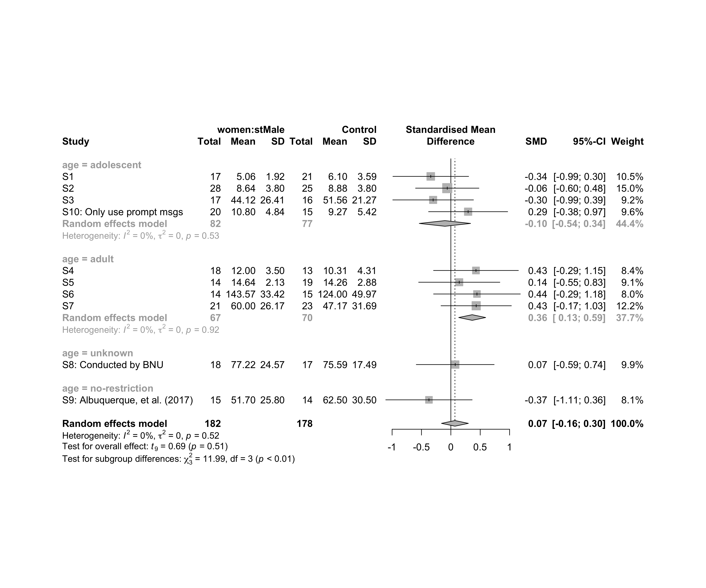
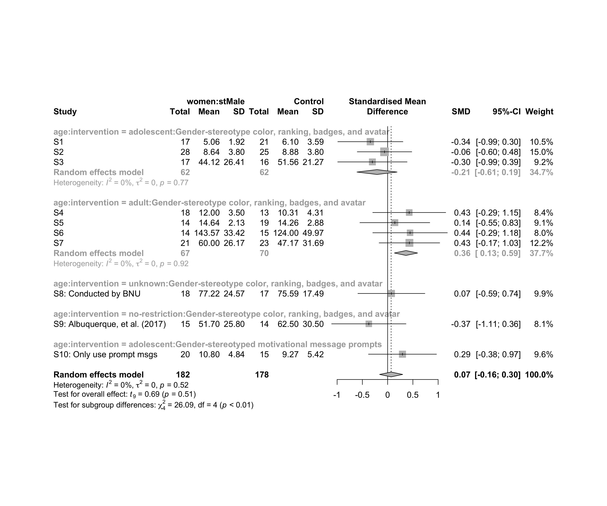

Metanalysis of performance on women caused by (`stMale`)
================
Geiser C. Challco <geiser@alumni.usp.br>

-   [Initial Variables and Loading
    Data](#initial-variables-and-loading-data)
-   [Perform meta-analyses](#perform-meta-analyses)
    -   [Subgroup analysis by “country”](#subgroup-analysis-by-country)
    -   [Subgroup analysis by “age”](#subgroup-analysis-by-age)
    -   [Subgroup analysis by “ed.level”](#subgroup-analysis-by-edlevel)
    -   [Subgroup analysis by
        “intervention”](#subgroup-analysis-by-intervention)
    -   [Subgroup analysis by
        “country:age”](#subgroup-analysis-by-countryage)
    -   [Subgroup analysis by
        “country:ed.level”](#subgroup-analysis-by-countryedlevel)
    -   [Subgroup analysis by
        “country:intervention”](#subgroup-analysis-by-countryintervention)
    -   [Subgroup analysis by
        “age:intervention”](#subgroup-analysis-by-ageintervention)
    -   [Subgroup analysis by
        “ed.level:intervention”](#subgroup-analysis-by-edlevelintervention)
    -   [Subgroup analysis by
        “country:age:intervention”](#subgroup-analysis-by-countryageintervention)
    -   [Subgroup analysis by
        “country:ed.level:intervention”](#subgroup-analysis-by-countryedlevelintervention)
-   [Funnel Plot](#funnel-plot)

## Initial Variables and Loading Data

``` r
env <- "stMale"
gender <- "women"
to_remove <- c('S11')
sub.groups <- c("country","age","ed.level","intervention",
                "country:age","country:ed.level","country:intervention",
                "age:intervention","ed.level:intervention",
                "country:age:intervention","country:ed.level:intervention")
```

``` r
dat <- read_excel("../data/data-without-outliers.xlsx", sheet = "perform-env.gender-descriptive")
dat <- dat[!dat$study %in% to_remove, ]

leg <- read_excel("../data/data-without-outliers.xlsx", sheet = "legend")
```

    ## New names:
    ## • `` -> `...10`

``` r
leg <- leg[!leg$study %in% to_remove, ]

idx.e <- which(dat$env == env & dat$gender == gender)
idx.c <- which(dat$env == "control" & dat$gender == gender)

data <- data.frame(
  study = dat$study[idx.c],
  n.e = dat$N[idx.e], mean.e = dat$M[idx.e], sd.e = dat$SD[idx.e],
  n.c = dat$N[idx.c], mean.c = dat$M[idx.c], sd.c = dat$SD[idx.c]
)
for (cgroups in strsplit(sub.groups,":")) {
  data[[paste0(cgroups, collapse = ":")]] <- sapply(data$study, FUN = function(x) {
    paste0(sapply(cgroups, FUN = function(namecol) leg[[namecol]][which(x == leg$study)]), collapse = ":")
  })
}
data[["lbl"]] <- sapply(data$study, FUN = function(x) leg$Note[which(x == leg$study)])
```

## Perform meta-analyses

``` r
m.cont <- metacont(
  n.e = n.e, mean.e = mean.e, sd.e = sd.e, n.c = n.c, mean.c = mean.c, sd.c = sd.c,
  studlab = lbl, data = data, sm = "SMD", method.smd = "Hedges",
  fixed = F, random = T, method.tau = "REML", hakn = T, title = paste("Performance for",gender,"in",env)
)
summary(m.cont)
```

    ## Review:     Performance for women in stMale
    ## 
    ##                                    SMD            95%-CI %W(random)
    ## S1                             -0.3420 [-0.9865; 0.3026]       10.5
    ## S2                             -0.0614 [-0.6009; 0.4780]       15.0
    ## S3                             -0.3018 [-0.9889; 0.3852]        9.2
    ## S4                              0.4275 [-0.2948; 1.1499]        8.4
    ## S5                              0.1428 [-0.5485; 0.8341]        9.1
    ## S6                              0.4443 [-0.2942; 1.1829]        8.0
    ## S7                              0.4315 [-0.1676; 1.0305]       12.2
    ## S8: Conducted by BNU            0.0743 [-0.5888; 0.7374]        9.9
    ## S9: Albuquerque, et al. (2017) -0.3727 [-1.1083; 0.3628]        8.1
    ## S10: Only use prompt msgs       0.2941 [-0.3794; 0.9675]        9.6
    ## 
    ## Number of studies combined: k = 10
    ## Number of observations: o = 360
    ## 
    ##                         SMD            95%-CI    t p-value
    ## Random effects model 0.0694 [-0.1595; 0.2982] 0.69  0.5101
    ## 
    ## Quantifying heterogeneity:
    ##  tau^2 = 0 [0.0000; 0.2388]; tau = 0 [0.0000; 0.4887]
    ##  I^2 = 0.0% [0.0%; 62.4%]; H = 1.00 [1.00; 1.63]
    ## 
    ## Test of heterogeneity:
    ##     Q d.f. p-value
    ##  8.11    9  0.5232
    ## 
    ## Details on meta-analytical method:
    ## - Inverse variance method
    ## - Restricted maximum-likelihood estimator for tau^2
    ## - Q-profile method for confidence interval of tau^2 and tau
    ## - Hartung-Knapp adjustment for random effects model
    ## - Hedges' g (bias corrected standardised mean difference; using exact formulae)

``` r
forest(m.cont, digits=2, digits.sd = 2, test.overall = T, label.e = paste0(gender,':',env))
```

<!-- -->

### Subgroup analysis by “country”

``` r
m.sg4sub <- update.meta(m.cont, subgroup = country, random = T, fixed = F)
summary(m.sg4sub)
```

    ## Review:     Performance for women in stMale
    ## 
    ##                                    SMD            95%-CI %W(random) country
    ## S1                             -0.3420 [-0.9865; 0.3026]       10.5  Brazil
    ## S2                             -0.0614 [-0.6009; 0.4780]       15.0  Brazil
    ## S3                             -0.3018 [-0.9889; 0.3852]        9.2  Brazil
    ## S4                              0.4275 [-0.2948; 1.1499]        8.4  Brazil
    ## S5                              0.1428 [-0.5485; 0.8341]        9.1  Brazil
    ## S6                              0.4443 [-0.2942; 1.1829]        8.0  Brazil
    ## S7                              0.4315 [-0.1676; 1.0305]       12.2  Brazil
    ## S8: Conducted by BNU            0.0743 [-0.5888; 0.7374]        9.9   China
    ## S9: Albuquerque, et al. (2017) -0.3727 [-1.1083; 0.3628]        8.1  Brazil
    ## S10: Only use prompt msgs       0.2941 [-0.3794; 0.9675]        9.6  Brazil
    ## 
    ## Number of studies combined: k = 10
    ## Number of observations: o = 360
    ## 
    ##                         SMD            95%-CI    t p-value
    ## Random effects model 0.0694 [-0.1595; 0.2982] 0.69  0.5101
    ## 
    ## Quantifying heterogeneity:
    ##  tau^2 = 0 [0.0000; 0.2388]; tau = 0 [0.0000; 0.4887]
    ##  I^2 = 0.0% [0.0%; 62.4%]; H = 1.00 [1.00; 1.63]
    ## 
    ## Test of heterogeneity:
    ##     Q d.f. p-value
    ##  8.11    9  0.5232
    ## 
    ## Results for subgroups (random effects model):
    ##                    k    SMD            95%-CI   tau^2    tau    Q  I^2
    ## country = Brazil   9 0.0688 [-0.1919; 0.3295] <0.0001 0.0014 8.11 1.3%
    ## country = China    1 0.0743 [-0.5888; 0.7374]      --     -- 0.00   --
    ## 
    ## Test for subgroup differences (random effects model):
    ##                     Q d.f. p-value
    ## Between groups   0.00    1  0.9877
    ## 
    ## Details on meta-analytical method:
    ## - Inverse variance method
    ## - Restricted maximum-likelihood estimator for tau^2
    ## - Q-profile method for confidence interval of tau^2 and tau
    ## - Hartung-Knapp adjustment for random effects model
    ## - Hedges' g (bias corrected standardised mean difference; using exact formulae)

``` r
forest(m.sg4sub, digits=2, digits.sd = 2, test.overall = T, label.e = paste0(gender,':',env))
```

<!-- -->

### Subgroup analysis by “age”

``` r
m.sg4sub <- update.meta(m.cont, subgroup = age, random = T, fixed = F)
summary(m.sg4sub)
```

    ## Review:     Performance for women in stMale
    ## 
    ##                                    SMD            95%-CI %W(random)            age
    ## S1                             -0.3420 [-0.9865; 0.3026]       10.5     adolescent
    ## S2                             -0.0614 [-0.6009; 0.4780]       15.0     adolescent
    ## S3                             -0.3018 [-0.9889; 0.3852]        9.2     adolescent
    ## S4                              0.4275 [-0.2948; 1.1499]        8.4          adult
    ## S5                              0.1428 [-0.5485; 0.8341]        9.1          adult
    ## S6                              0.4443 [-0.2942; 1.1829]        8.0          adult
    ## S7                              0.4315 [-0.1676; 1.0305]       12.2          adult
    ## S8: Conducted by BNU            0.0743 [-0.5888; 0.7374]        9.9        unknown
    ## S9: Albuquerque, et al. (2017) -0.3727 [-1.1083; 0.3628]        8.1 no-restriction
    ## S10: Only use prompt msgs       0.2941 [-0.3794; 0.9675]        9.6     adolescent
    ## 
    ## Number of studies combined: k = 10
    ## Number of observations: o = 360
    ## 
    ##                         SMD            95%-CI    t p-value
    ## Random effects model 0.0694 [-0.1595; 0.2982] 0.69  0.5101
    ## 
    ## Quantifying heterogeneity:
    ##  tau^2 = 0 [0.0000; 0.2388]; tau = 0 [0.0000; 0.4887]
    ##  I^2 = 0.0% [0.0%; 62.4%]; H = 1.00 [1.00; 1.63]
    ## 
    ## Test of heterogeneity:
    ##     Q d.f. p-value
    ##  8.11    9  0.5232
    ## 
    ## Results for subgroups (random effects model):
    ##                        k     SMD            95%-CI tau^2 tau    Q  I^2
    ## age = adolescent       4 -0.1008 [-0.5377; 0.3360]     0   0 2.21 0.0%
    ## age = adult            4  0.3633 [ 0.1338; 0.5928]     0   0 0.52 0.0%
    ## age = unknown          1  0.0743 [-0.5888; 0.7374]    --  -- 0.00   --
    ## age = no-restriction   1 -0.3727 [-1.1083; 0.3628]    --  -- 0.00   --
    ## 
    ## Test for subgroup differences (random effects model):
    ##                      Q d.f. p-value
    ## Between groups   11.99    3  0.0074
    ## 
    ## Details on meta-analytical method:
    ## - Inverse variance method
    ## - Restricted maximum-likelihood estimator for tau^2
    ## - Q-profile method for confidence interval of tau^2 and tau
    ## - Hartung-Knapp adjustment for random effects model
    ## - Hedges' g (bias corrected standardised mean difference; using exact formulae)

``` r
forest(m.sg4sub, digits=2, digits.sd = 2, test.overall = T, label.e = paste0(gender,':',env))
```

<!-- -->

### Subgroup analysis by “ed.level”

``` r
m.sg4sub <- update.meta(m.cont, subgroup = ed.level, random = T, fixed = F)
summary(m.sg4sub)
```

    ## Review:     Performance for women in stMale
    ## 
    ##                                    SMD            95%-CI %W(random)         ed.level
    ## S1                             -0.3420 [-0.9865; 0.3026]       10.5  upper-secundary
    ## S2                             -0.0614 [-0.6009; 0.4780]       15.0  upper-secundary
    ## S3                             -0.3018 [-0.9889; 0.3852]        9.2  upper-secundary
    ## S4                              0.4275 [-0.2948; 1.1499]        8.4 higher-education
    ## S5                              0.1428 [-0.5485; 0.8341]        9.1 higher-education
    ## S6                              0.4443 [-0.2942; 1.1829]        8.0 higher-education
    ## S7                              0.4315 [-0.1676; 1.0305]       12.2          unknown
    ## S8: Conducted by BNU            0.0743 [-0.5888; 0.7374]        9.9          unknown
    ## S9: Albuquerque, et al. (2017) -0.3727 [-1.1083; 0.3628]        8.1          unknown
    ## S10: Only use prompt msgs       0.2941 [-0.3794; 0.9675]        9.6  upper-secundary
    ## 
    ## Number of studies combined: k = 10
    ## Number of observations: o = 360
    ## 
    ##                         SMD            95%-CI    t p-value
    ## Random effects model 0.0694 [-0.1595; 0.2982] 0.69  0.5101
    ## 
    ## Quantifying heterogeneity:
    ##  tau^2 = 0 [0.0000; 0.2388]; tau = 0 [0.0000; 0.4887]
    ##  I^2 = 0.0% [0.0%; 62.4%]; H = 1.00 [1.00; 1.63]
    ## 
    ## Test of heterogeneity:
    ##     Q d.f. p-value
    ##  8.11    9  0.5232
    ## 
    ## Results for subgroups (random effects model):
    ##                               k     SMD            95%-CI  tau^2    tau    Q   I^2
    ## ed.level = upper-secundary    4 -0.1008 [-0.5377; 0.3360]      0      0 2.21  0.0%
    ## ed.level = higher-education   3  0.3308 [-0.0970; 0.7586]      0      0 0.44  0.0%
    ## ed.level = unknown            3  0.0840 [-0.9049; 1.0730] 0.0431 0.2077 2.77 27.8%
    ## 
    ## Test for subgroup differences (random effects model):
    ##                     Q d.f. p-value
    ## Between groups   6.65    2  0.0360
    ## 
    ## Details on meta-analytical method:
    ## - Inverse variance method
    ## - Restricted maximum-likelihood estimator for tau^2
    ## - Q-profile method for confidence interval of tau^2 and tau
    ## - Hartung-Knapp adjustment for random effects model
    ## - Hedges' g (bias corrected standardised mean difference; using exact formulae)

``` r
forest(m.sg4sub, digits=2, digits.sd = 2, test.overall = T, label.e = paste0(gender,':',env))
```

<!-- -->

### Subgroup analysis by “intervention”

``` r
m.sg4sub <- update.meta(m.cont, subgroup = intervention, random = T, fixed = F)
summary(m.sg4sub)
```

    ## Review:     Performance for women in stMale
    ## 
    ##                                    SMD            95%-CI %W(random)
    ## S1                             -0.3420 [-0.9865; 0.3026]       10.5
    ## S2                             -0.0614 [-0.6009; 0.4780]       15.0
    ## S3                             -0.3018 [-0.9889; 0.3852]        9.2
    ## S4                              0.4275 [-0.2948; 1.1499]        8.4
    ## S5                              0.1428 [-0.5485; 0.8341]        9.1
    ## S6                              0.4443 [-0.2942; 1.1829]        8.0
    ## S7                              0.4315 [-0.1676; 1.0305]       12.2
    ## S8: Conducted by BNU            0.0743 [-0.5888; 0.7374]        9.9
    ## S9: Albuquerque, et al. (2017) -0.3727 [-1.1083; 0.3628]        8.1
    ## S10: Only use prompt msgs       0.2941 [-0.3794; 0.9675]        9.6
    ##                                                                        intervention
    ## S1                             Gender-stereotype color, ranking, badges, and avatar
    ## S2                             Gender-stereotype color, ranking, badges, and avatar
    ## S3                             Gender-stereotype color, ranking, badges, and avatar
    ## S4                             Gender-stereotype color, ranking, badges, and avatar
    ## S5                             Gender-stereotype color, ranking, badges, and avatar
    ## S6                             Gender-stereotype color, ranking, badges, and avatar
    ## S7                             Gender-stereotype color, ranking, badges, and avatar
    ## S8: Conducted by BNU           Gender-stereotype color, ranking, badges, and avatar
    ## S9: Albuquerque, et al. (2017) Gender-stereotype color, ranking, badges, and avatar
    ## S10: Only use prompt msgs           Gender-stereotyped motivational message prompts
    ## 
    ## Number of studies combined: k = 10
    ## Number of observations: o = 360
    ## 
    ##                         SMD            95%-CI    t p-value
    ## Random effects model 0.0694 [-0.1595; 0.2982] 0.69  0.5101
    ## 
    ## Quantifying heterogeneity:
    ##  tau^2 = 0 [0.0000; 0.2388]; tau = 0 [0.0000; 0.4887]
    ##  I^2 = 0.0% [0.0%; 62.4%]; H = 1.00 [1.00; 1.63]
    ## 
    ## Test of heterogeneity:
    ##     Q d.f. p-value
    ##  8.11    9  0.5232
    ## 
    ## Results for subgroups (random effects model):
    ##                                                      k    SMD            95%-CI tau^2 tau    Q  I^2
    ## intervention = Gender-stereotype color, rankin ...   9 0.0455 [-0.2071; 0.2980]     0   0 7.64 0.0%
    ## intervention = Gender-stereotyped motivational ...   1 0.2941 [-0.3794; 0.9675]    --  -- 0.00   --
    ## 
    ## Test for subgroup differences (random effects model):
    ##                     Q d.f. p-value
    ## Between groups   0.48    1  0.4906
    ## 
    ## Details on meta-analytical method:
    ## - Inverse variance method
    ## - Restricted maximum-likelihood estimator for tau^2
    ## - Q-profile method for confidence interval of tau^2 and tau
    ## - Hartung-Knapp adjustment for random effects model
    ## - Hedges' g (bias corrected standardised mean difference; using exact formulae)

``` r
forest(m.sg4sub, digits=2, digits.sd = 2, test.overall = T, label.e = paste0(gender,':',env))
```

<!-- -->

### Subgroup analysis by “country:age”

``` r
m.sg4sub <- update.meta(m.cont, subgroup = `country:age`, random = T, fixed = F)
summary(m.sg4sub)
```

    ## Review:     Performance for women in stMale
    ## 
    ##                                    SMD            95%-CI %W(random)           country:age
    ## S1                             -0.3420 [-0.9865; 0.3026]       10.5     Brazil:adolescent
    ## S2                             -0.0614 [-0.6009; 0.4780]       15.0     Brazil:adolescent
    ## S3                             -0.3018 [-0.9889; 0.3852]        9.2     Brazil:adolescent
    ## S4                              0.4275 [-0.2948; 1.1499]        8.4          Brazil:adult
    ## S5                              0.1428 [-0.5485; 0.8341]        9.1          Brazil:adult
    ## S6                              0.4443 [-0.2942; 1.1829]        8.0          Brazil:adult
    ## S7                              0.4315 [-0.1676; 1.0305]       12.2          Brazil:adult
    ## S8: Conducted by BNU            0.0743 [-0.5888; 0.7374]        9.9         China:unknown
    ## S9: Albuquerque, et al. (2017) -0.3727 [-1.1083; 0.3628]        8.1 Brazil:no-restriction
    ## S10: Only use prompt msgs       0.2941 [-0.3794; 0.9675]        9.6     Brazil:adolescent
    ## 
    ## Number of studies combined: k = 10
    ## Number of observations: o = 360
    ## 
    ##                         SMD            95%-CI    t p-value
    ## Random effects model 0.0694 [-0.1595; 0.2982] 0.69  0.5101
    ## 
    ## Quantifying heterogeneity:
    ##  tau^2 = 0 [0.0000; 0.2388]; tau = 0 [0.0000; 0.4887]
    ##  I^2 = 0.0% [0.0%; 62.4%]; H = 1.00 [1.00; 1.63]
    ## 
    ## Test of heterogeneity:
    ##     Q d.f. p-value
    ##  8.11    9  0.5232
    ## 
    ## Results for subgroups (random effects model):
    ##                                       k     SMD            95%-CI tau^2 tau    Q  I^2
    ## country:age = Brazil:adolescent       4 -0.1008 [-0.5377; 0.3360]     0   0 2.21 0.0%
    ## country:age = Brazil:adult            4  0.3633 [ 0.1338; 0.5928]     0   0 0.52 0.0%
    ## country:age = China:unknown           1  0.0743 [-0.5888; 0.7374]    --  -- 0.00   --
    ## country:age = Brazil:no-restriction   1 -0.3727 [-1.1083; 0.3628]    --  -- 0.00   --
    ## 
    ## Test for subgroup differences (random effects model):
    ##                      Q d.f. p-value
    ## Between groups   11.99    3  0.0074
    ## 
    ## Details on meta-analytical method:
    ## - Inverse variance method
    ## - Restricted maximum-likelihood estimator for tau^2
    ## - Q-profile method for confidence interval of tau^2 and tau
    ## - Hartung-Knapp adjustment for random effects model
    ## - Hedges' g (bias corrected standardised mean difference; using exact formulae)

``` r
forest(m.sg4sub, digits=2, digits.sd = 2, test.overall = T, label.e = paste0(gender,':',env))
```

<!-- -->

### Subgroup analysis by “country:ed.level”

``` r
m.sg4sub <- update.meta(m.cont, subgroup = `country:ed.level`, random = T, fixed = F)
summary(m.sg4sub)
```

    ## Review:     Performance for women in stMale
    ## 
    ##                                    SMD            95%-CI %W(random)        country:ed.level
    ## S1                             -0.3420 [-0.9865; 0.3026]       10.5  Brazil:upper-secundary
    ## S2                             -0.0614 [-0.6009; 0.4780]       15.0  Brazil:upper-secundary
    ## S3                             -0.3018 [-0.9889; 0.3852]        9.2  Brazil:upper-secundary
    ## S4                              0.4275 [-0.2948; 1.1499]        8.4 Brazil:higher-education
    ## S5                              0.1428 [-0.5485; 0.8341]        9.1 Brazil:higher-education
    ## S6                              0.4443 [-0.2942; 1.1829]        8.0 Brazil:higher-education
    ## S7                              0.4315 [-0.1676; 1.0305]       12.2          Brazil:unknown
    ## S8: Conducted by BNU            0.0743 [-0.5888; 0.7374]        9.9           China:unknown
    ## S9: Albuquerque, et al. (2017) -0.3727 [-1.1083; 0.3628]        8.1          Brazil:unknown
    ## S10: Only use prompt msgs       0.2941 [-0.3794; 0.9675]        9.6  Brazil:upper-secundary
    ## 
    ## Number of studies combined: k = 10
    ## Number of observations: o = 360
    ## 
    ##                         SMD            95%-CI    t p-value
    ## Random effects model 0.0694 [-0.1595; 0.2982] 0.69  0.5101
    ## 
    ## Quantifying heterogeneity:
    ##  tau^2 = 0 [0.0000; 0.2388]; tau = 0 [0.0000; 0.4887]
    ##  I^2 = 0.0% [0.0%; 62.4%]; H = 1.00 [1.00; 1.63]
    ## 
    ## Test of heterogeneity:
    ##     Q d.f. p-value
    ##  8.11    9  0.5232
    ## 
    ## Results for subgroups (random effects model):
    ##                                              k     SMD            95%-CI  tau^2    tau    Q   I^2
    ## country:ed.level = Brazil:upper-secundary    4 -0.1008 [-0.5377; 0.3360]      0      0 2.21  0.0%
    ## country:ed.level = Brazil:higher-education   3  0.3308 [-0.0970; 0.7586]      0      0 0.44  0.0%
    ## country:ed.level = Brazil:unknown            2  0.0589 [-5.0366; 5.1543] 0.2062 0.4541 2.76 63.8%
    ## country:ed.level = China:unknown             1  0.0743 [-0.5888; 0.7374]     --     -- 0.00    --
    ## 
    ## Test for subgroup differences (random effects model):
    ##                     Q d.f. p-value
    ## Between groups   6.66    3  0.0834
    ## 
    ## Details on meta-analytical method:
    ## - Inverse variance method
    ## - Restricted maximum-likelihood estimator for tau^2
    ## - Q-profile method for confidence interval of tau^2 and tau
    ## - Hartung-Knapp adjustment for random effects model
    ## - Hedges' g (bias corrected standardised mean difference; using exact formulae)

``` r
forest(m.sg4sub, digits=2, digits.sd = 2, test.overall = T, label.e = paste0(gender,':',env))
```

<!-- -->

### Subgroup analysis by “country:intervention”

``` r
m.sg4sub <- update.meta(m.cont, subgroup = `country:intervention`, random = T, fixed = F)
summary(m.sg4sub)
```

    ## Review:     Performance for women in stMale
    ## 
    ##                                    SMD            95%-CI %W(random)
    ## S1                             -0.3420 [-0.9865; 0.3026]       10.5
    ## S2                             -0.0614 [-0.6009; 0.4780]       15.0
    ## S3                             -0.3018 [-0.9889; 0.3852]        9.2
    ## S4                              0.4275 [-0.2948; 1.1499]        8.4
    ## S5                              0.1428 [-0.5485; 0.8341]        9.1
    ## S6                              0.4443 [-0.2942; 1.1829]        8.0
    ## S7                              0.4315 [-0.1676; 1.0305]       12.2
    ## S8: Conducted by BNU            0.0743 [-0.5888; 0.7374]        9.9
    ## S9: Albuquerque, et al. (2017) -0.3727 [-1.1083; 0.3628]        8.1
    ## S10: Only use prompt msgs       0.2941 [-0.3794; 0.9675]        9.6
    ##                                                                       country:intervention
    ## S1                             Brazil:Gender-stereotype color, ranking, badges, and avatar
    ## S2                             Brazil:Gender-stereotype color, ranking, badges, and avatar
    ## S3                             Brazil:Gender-stereotype color, ranking, badges, and avatar
    ## S4                             Brazil:Gender-stereotype color, ranking, badges, and avatar
    ## S5                             Brazil:Gender-stereotype color, ranking, badges, and avatar
    ## S6                             Brazil:Gender-stereotype color, ranking, badges, and avatar
    ## S7                             Brazil:Gender-stereotype color, ranking, badges, and avatar
    ## S8: Conducted by BNU            China:Gender-stereotype color, ranking, badges, and avatar
    ## S9: Albuquerque, et al. (2017) Brazil:Gender-stereotype color, ranking, badges, and avatar
    ## S10: Only use prompt msgs           Brazil:Gender-stereotyped motivational message prompts
    ## 
    ## Number of studies combined: k = 10
    ## Number of observations: o = 360
    ## 
    ##                         SMD            95%-CI    t p-value
    ## Random effects model 0.0694 [-0.1595; 0.2982] 0.69  0.5101
    ## 
    ## Quantifying heterogeneity:
    ##  tau^2 = 0 [0.0000; 0.2388]; tau = 0 [0.0000; 0.4887]
    ##  I^2 = 0.0% [0.0%; 62.4%]; H = 1.00 [1.00; 1.63]
    ## 
    ## Test of heterogeneity:
    ##     Q d.f. p-value
    ##  8.11    9  0.5232
    ## 
    ## Results for subgroups (random effects model):
    ##                                                              k    SMD            95%-CI  tau^2    tau    Q
    ## country:intervention = Brazil:Gender-stereotype color, ...   8 0.0421 [-0.2519; 0.3361] 0.0069 0.0829 7.63
    ## country:intervention = China:Gender-stereotype color,  ...   1 0.0743 [-0.5888; 0.7374]     --     -- 0.00
    ## country:intervention = Brazil:Gender-stereotyped motiv ...   1 0.2941 [-0.3794; 0.9675]     --     -- 0.00
    ##                                                             I^2
    ## country:intervention = Brazil:Gender-stereotype color, ... 8.2%
    ## country:intervention = China:Gender-stereotype color,  ...   --
    ## country:intervention = Brazil:Gender-stereotyped motiv ...   --
    ## 
    ## Test for subgroup differences (random effects model):
    ##                     Q d.f. p-value
    ## Between groups   0.48    2  0.7884
    ## 
    ## Details on meta-analytical method:
    ## - Inverse variance method
    ## - Restricted maximum-likelihood estimator for tau^2
    ## - Q-profile method for confidence interval of tau^2 and tau
    ## - Hartung-Knapp adjustment for random effects model
    ## - Hedges' g (bias corrected standardised mean difference; using exact formulae)

``` r
forest(m.sg4sub, digits=2, digits.sd = 2, test.overall = T, label.e = paste0(gender,':',env))
```

<!-- -->

### Subgroup analysis by “age:intervention”

``` r
m.sg4sub <- update.meta(m.cont, subgroup = `age:intervention`, random = T, fixed = F)
summary(m.sg4sub)
```

    ## Review:     Performance for women in stMale
    ## 
    ##                                    SMD            95%-CI %W(random)
    ## S1                             -0.3420 [-0.9865; 0.3026]       10.5
    ## S2                             -0.0614 [-0.6009; 0.4780]       15.0
    ## S3                             -0.3018 [-0.9889; 0.3852]        9.2
    ## S4                              0.4275 [-0.2948; 1.1499]        8.4
    ## S5                              0.1428 [-0.5485; 0.8341]        9.1
    ## S6                              0.4443 [-0.2942; 1.1829]        8.0
    ## S7                              0.4315 [-0.1676; 1.0305]       12.2
    ## S8: Conducted by BNU            0.0743 [-0.5888; 0.7374]        9.9
    ## S9: Albuquerque, et al. (2017) -0.3727 [-1.1083; 0.3628]        8.1
    ## S10: Only use prompt msgs       0.2941 [-0.3794; 0.9675]        9.6
    ##                                                                                   age:intervention
    ## S1                                 adolescent:Gender-stereotype color, ranking, badges, and avatar
    ## S2                                 adolescent:Gender-stereotype color, ranking, badges, and avatar
    ## S3                                 adolescent:Gender-stereotype color, ranking, badges, and avatar
    ## S4                                      adult:Gender-stereotype color, ranking, badges, and avatar
    ## S5                                      adult:Gender-stereotype color, ranking, badges, and avatar
    ## S6                                      adult:Gender-stereotype color, ranking, badges, and avatar
    ## S7                                      adult:Gender-stereotype color, ranking, badges, and avatar
    ## S8: Conducted by BNU                  unknown:Gender-stereotype color, ranking, badges, and avatar
    ## S9: Albuquerque, et al. (2017) no-restriction:Gender-stereotype color, ranking, badges, and avatar
    ## S10: Only use prompt msgs               adolescent:Gender-stereotyped motivational message prompts
    ## 
    ## Number of studies combined: k = 10
    ## Number of observations: o = 360
    ## 
    ##                         SMD            95%-CI    t p-value
    ## Random effects model 0.0694 [-0.1595; 0.2982] 0.69  0.5101
    ## 
    ## Quantifying heterogeneity:
    ##  tau^2 = 0 [0.0000; 0.2388]; tau = 0 [0.0000; 0.4887]
    ##  I^2 = 0.0% [0.0%; 62.4%]; H = 1.00 [1.00; 1.63]
    ## 
    ## Test of heterogeneity:
    ##     Q d.f. p-value
    ##  8.11    9  0.5232
    ## 
    ## Results for subgroups (random effects model):
    ##                                                          k     SMD            95%-CI tau^2 tau    Q  I^2
    ## age:intervention = adolescent:Gender-stereotype co ...   3 -0.2102 [-0.6073; 0.1869]     0   0 0.52 0.0%
    ## age:intervention = adult:Gender-stereotype color,  ...   4  0.3633 [ 0.1338; 0.5928]     0   0 0.52 0.0%
    ## age:intervention = unknown:Gender-stereotype color ...   1  0.0743 [-0.5888; 0.7374]    --  -- 0.00   --
    ## age:intervention = no-restriction:Gender-stereotyp ...   1 -0.3727 [-1.1083; 0.3628]    --  -- 0.00   --
    ## age:intervention = adolescent:Gender-stereotyped m ...   1  0.2941 [-0.3794; 0.9675]    --  -- 0.00   --
    ## 
    ## Test for subgroup differences (random effects model):
    ##                      Q d.f.  p-value
    ## Between groups   26.09    4 < 0.0001
    ## 
    ## Details on meta-analytical method:
    ## - Inverse variance method
    ## - Restricted maximum-likelihood estimator for tau^2
    ## - Q-profile method for confidence interval of tau^2 and tau
    ## - Hartung-Knapp adjustment for random effects model
    ## - Hedges' g (bias corrected standardised mean difference; using exact formulae)

``` r
forest(m.sg4sub, digits=2, digits.sd = 2, test.overall = T, label.e = paste0(gender,':',env))
```

<!-- -->

### Subgroup analysis by “ed.level:intervention”

``` r
m.sg4sub <- update.meta(m.cont, subgroup = `ed.level:intervention`, random = T, fixed = F)
summary(m.sg4sub)
```

    ## Review:     Performance for women in stMale
    ## 
    ##                                    SMD            95%-CI %W(random)
    ## S1                             -0.3420 [-0.9865; 0.3026]       10.5
    ## S2                             -0.0614 [-0.6009; 0.4780]       15.0
    ## S3                             -0.3018 [-0.9889; 0.3852]        9.2
    ## S4                              0.4275 [-0.2948; 1.1499]        8.4
    ## S5                              0.1428 [-0.5485; 0.8341]        9.1
    ## S6                              0.4443 [-0.2942; 1.1829]        8.0
    ## S7                              0.4315 [-0.1676; 1.0305]       12.2
    ## S8: Conducted by BNU            0.0743 [-0.5888; 0.7374]        9.9
    ## S9: Albuquerque, et al. (2017) -0.3727 [-1.1083; 0.3628]        8.1
    ## S10: Only use prompt msgs       0.2941 [-0.3794; 0.9675]        9.6
    ##                                                                                ed.level:intervention
    ## S1                              upper-secundary:Gender-stereotype color, ranking, badges, and avatar
    ## S2                              upper-secundary:Gender-stereotype color, ranking, badges, and avatar
    ## S3                              upper-secundary:Gender-stereotype color, ranking, badges, and avatar
    ## S4                             higher-education:Gender-stereotype color, ranking, badges, and avatar
    ## S5                             higher-education:Gender-stereotype color, ranking, badges, and avatar
    ## S6                             higher-education:Gender-stereotype color, ranking, badges, and avatar
    ## S7                                      unknown:Gender-stereotype color, ranking, badges, and avatar
    ## S8: Conducted by BNU                    unknown:Gender-stereotype color, ranking, badges, and avatar
    ## S9: Albuquerque, et al. (2017)          unknown:Gender-stereotype color, ranking, badges, and avatar
    ## S10: Only use prompt msgs            upper-secundary:Gender-stereotyped motivational message prompts
    ## 
    ## Number of studies combined: k = 10
    ## Number of observations: o = 360
    ## 
    ##                         SMD            95%-CI    t p-value
    ## Random effects model 0.0694 [-0.1595; 0.2982] 0.69  0.5101
    ## 
    ## Quantifying heterogeneity:
    ##  tau^2 = 0 [0.0000; 0.2388]; tau = 0 [0.0000; 0.4887]
    ##  I^2 = 0.0% [0.0%; 62.4%]; H = 1.00 [1.00; 1.63]
    ## 
    ## Test of heterogeneity:
    ##     Q d.f. p-value
    ##  8.11    9  0.5232
    ## 
    ## Results for subgroups (random effects model):
    ##                                                               k     SMD            95%-CI  tau^2    tau
    ## ed.level:intervention = upper-secundary:Gender-stereoty ...   3 -0.2102 [-0.6073; 0.1869]      0      0
    ## ed.level:intervention = higher-education:Gender-stereot ...   3  0.3308 [-0.0970; 0.7586]      0      0
    ## ed.level:intervention = unknown:Gender-stereotype color ...   3  0.0840 [-0.9049; 1.0730] 0.0431 0.2077
    ## ed.level:intervention = upper-secundary:Gender-stereoty ...   1  0.2941 [-0.3794; 0.9675]     --     --
    ##                                                                Q   I^2
    ## ed.level:intervention = upper-secundary:Gender-stereoty ... 0.52  0.0%
    ## ed.level:intervention = higher-education:Gender-stereot ... 0.44  0.0%
    ## ed.level:intervention = unknown:Gender-stereotype color ... 2.77 27.8%
    ## ed.level:intervention = upper-secundary:Gender-stereoty ... 0.00    --
    ## 
    ## Test for subgroup differences (random effects model):
    ##                      Q d.f. p-value
    ## Between groups   16.45    3  0.0009
    ## 
    ## Details on meta-analytical method:
    ## - Inverse variance method
    ## - Restricted maximum-likelihood estimator for tau^2
    ## - Q-profile method for confidence interval of tau^2 and tau
    ## - Hartung-Knapp adjustment for random effects model
    ## - Hedges' g (bias corrected standardised mean difference; using exact formulae)

``` r
forest(m.sg4sub, digits=2, digits.sd = 2, test.overall = T, label.e = paste0(gender,':',env))
```

<!-- -->

### Subgroup analysis by “country:age:intervention”

``` r
m.sg4sub <- update.meta(m.cont, subgroup = `country:age:intervention`, random = T, fixed = F)
summary(m.sg4sub)
```

    ## Review:     Performance for women in stMale
    ## 
    ##                                    SMD            95%-CI %W(random)
    ## S1                             -0.3420 [-0.9865; 0.3026]       10.5
    ## S2                             -0.0614 [-0.6009; 0.4780]       15.0
    ## S3                             -0.3018 [-0.9889; 0.3852]        9.2
    ## S4                              0.4275 [-0.2948; 1.1499]        8.4
    ## S5                              0.1428 [-0.5485; 0.8341]        9.1
    ## S6                              0.4443 [-0.2942; 1.1829]        8.0
    ## S7                              0.4315 [-0.1676; 1.0305]       12.2
    ## S8: Conducted by BNU            0.0743 [-0.5888; 0.7374]        9.9
    ## S9: Albuquerque, et al. (2017) -0.3727 [-1.1083; 0.3628]        8.1
    ## S10: Only use prompt msgs       0.2941 [-0.3794; 0.9675]        9.6
    ##                                                                                  country:age:intervention
    ## S1                                 Brazil:adolescent:Gender-stereotype color, ranking, badges, and avatar
    ## S2                                 Brazil:adolescent:Gender-stereotype color, ranking, badges, and avatar
    ## S3                                 Brazil:adolescent:Gender-stereotype color, ranking, badges, and avatar
    ## S4                                      Brazil:adult:Gender-stereotype color, ranking, badges, and avatar
    ## S5                                      Brazil:adult:Gender-stereotype color, ranking, badges, and avatar
    ## S6                                      Brazil:adult:Gender-stereotype color, ranking, badges, and avatar
    ## S7                                      Brazil:adult:Gender-stereotype color, ranking, badges, and avatar
    ## S8: Conducted by BNU                   China:unknown:Gender-stereotype color, ranking, badges, and avatar
    ## S9: Albuquerque, et al. (2017) Brazil:no-restriction:Gender-stereotype color, ranking, badges, and avatar
    ## S10: Only use prompt msgs               Brazil:adolescent:Gender-stereotyped motivational message prompts
    ## 
    ## Number of studies combined: k = 10
    ## Number of observations: o = 360
    ## 
    ##                         SMD            95%-CI    t p-value
    ## Random effects model 0.0694 [-0.1595; 0.2982] 0.69  0.5101
    ## 
    ## Quantifying heterogeneity:
    ##  tau^2 = 0 [0.0000; 0.2388]; tau = 0 [0.0000; 0.4887]
    ##  I^2 = 0.0% [0.0%; 62.4%]; H = 1.00 [1.00; 1.63]
    ## 
    ## Test of heterogeneity:
    ##     Q d.f. p-value
    ##  8.11    9  0.5232
    ## 
    ## Results for subgroups (random effects model):
    ##                                                                  k     SMD            95%-CI tau^2 tau    Q
    ## country:age:intervention = Brazil:adolescent:Gender-stereo ...   3 -0.2102 [-0.6073; 0.1869]     0   0 0.52
    ## country:age:intervention = Brazil:adult:Gender-stereotype  ...   4  0.3633 [ 0.1338; 0.5928]     0   0 0.52
    ## country:age:intervention = China:unknown:Gender-stereotype ...   1  0.0743 [-0.5888; 0.7374]    --  -- 0.00
    ## country:age:intervention = Brazil:no-restriction:Gender-st ...   1 -0.3727 [-1.1083; 0.3628]    --  -- 0.00
    ## country:age:intervention = Brazil:adolescent:Gender-stereo ...   1  0.2941 [-0.3794; 0.9675]    --  -- 0.00
    ##                                                                 I^2
    ## country:age:intervention = Brazil:adolescent:Gender-stereo ... 0.0%
    ## country:age:intervention = Brazil:adult:Gender-stereotype  ... 0.0%
    ## country:age:intervention = China:unknown:Gender-stereotype ...   --
    ## country:age:intervention = Brazil:no-restriction:Gender-st ...   --
    ## country:age:intervention = Brazil:adolescent:Gender-stereo ...   --
    ## 
    ## Test for subgroup differences (random effects model):
    ##                      Q d.f.  p-value
    ## Between groups   26.09    4 < 0.0001
    ## 
    ## Details on meta-analytical method:
    ## - Inverse variance method
    ## - Restricted maximum-likelihood estimator for tau^2
    ## - Q-profile method for confidence interval of tau^2 and tau
    ## - Hartung-Knapp adjustment for random effects model
    ## - Hedges' g (bias corrected standardised mean difference; using exact formulae)

``` r
forest(m.sg4sub, digits=2, digits.sd = 2, test.overall = T, label.e = paste0(gender,':',env))
```

<!-- -->

### Subgroup analysis by “country:ed.level:intervention”

``` r
m.sg4sub <- update.meta(m.cont, subgroup = `country:ed.level:intervention`, random = T, fixed = F)
summary(m.sg4sub)
```

    ## Review:     Performance for women in stMale
    ## 
    ##                                    SMD            95%-CI %W(random)
    ## S1                             -0.3420 [-0.9865; 0.3026]       10.5
    ## S2                             -0.0614 [-0.6009; 0.4780]       15.0
    ## S3                             -0.3018 [-0.9889; 0.3852]        9.2
    ## S4                              0.4275 [-0.2948; 1.1499]        8.4
    ## S5                              0.1428 [-0.5485; 0.8341]        9.1
    ## S6                              0.4443 [-0.2942; 1.1829]        8.0
    ## S7                              0.4315 [-0.1676; 1.0305]       12.2
    ## S8: Conducted by BNU            0.0743 [-0.5888; 0.7374]        9.9
    ## S9: Albuquerque, et al. (2017) -0.3727 [-1.1083; 0.3628]        8.1
    ## S10: Only use prompt msgs       0.2941 [-0.3794; 0.9675]        9.6
    ##                                                                               country:ed.level:intervention
    ## S1                              Brazil:upper-secundary:Gender-stereotype color, ranking, badges, and avatar
    ## S2                              Brazil:upper-secundary:Gender-stereotype color, ranking, badges, and avatar
    ## S3                              Brazil:upper-secundary:Gender-stereotype color, ranking, badges, and avatar
    ## S4                             Brazil:higher-education:Gender-stereotype color, ranking, badges, and avatar
    ## S5                             Brazil:higher-education:Gender-stereotype color, ranking, badges, and avatar
    ## S6                             Brazil:higher-education:Gender-stereotype color, ranking, badges, and avatar
    ## S7                                      Brazil:unknown:Gender-stereotype color, ranking, badges, and avatar
    ## S8: Conducted by BNU                     China:unknown:Gender-stereotype color, ranking, badges, and avatar
    ## S9: Albuquerque, et al. (2017)          Brazil:unknown:Gender-stereotype color, ranking, badges, and avatar
    ## S10: Only use prompt msgs            Brazil:upper-secundary:Gender-stereotyped motivational message prompts
    ## 
    ## Number of studies combined: k = 10
    ## Number of observations: o = 360
    ## 
    ##                         SMD            95%-CI    t p-value
    ## Random effects model 0.0694 [-0.1595; 0.2982] 0.69  0.5101
    ## 
    ## Quantifying heterogeneity:
    ##  tau^2 = 0 [0.0000; 0.2388]; tau = 0 [0.0000; 0.4887]
    ##  I^2 = 0.0% [0.0%; 62.4%]; H = 1.00 [1.00; 1.63]
    ## 
    ## Test of heterogeneity:
    ##     Q d.f. p-value
    ##  8.11    9  0.5232
    ## 
    ## Results for subgroups (random effects model):
    ##                                                                       k     SMD            95%-CI  tau^2
    ## country:ed.level:intervention = Brazil:upper-secundary:Gender-s ...   3 -0.2102 [-0.6073; 0.1869]      0
    ## country:ed.level:intervention = Brazil:higher-education:Gender- ...   3  0.3308 [-0.0970; 0.7586]      0
    ## country:ed.level:intervention = Brazil:unknown:Gender-stereotyp ...   2  0.0589 [-5.0366; 5.1543] 0.2062
    ## country:ed.level:intervention = China:unknown:Gender-stereotype ...   1  0.0743 [-0.5888; 0.7374]     --
    ## country:ed.level:intervention = Brazil:upper-secundary:Gender-s ...   1  0.2941 [-0.3794; 0.9675]     --
    ##                                                                        tau    Q   I^2
    ## country:ed.level:intervention = Brazil:upper-secundary:Gender-s ...      0 0.52  0.0%
    ## country:ed.level:intervention = Brazil:higher-education:Gender- ...      0 0.44  0.0%
    ## country:ed.level:intervention = Brazil:unknown:Gender-stereotyp ... 0.4541 2.76 63.8%
    ## country:ed.level:intervention = China:unknown:Gender-stereotype ...     -- 0.00    --
    ## country:ed.level:intervention = Brazil:upper-secundary:Gender-s ...     -- 0.00    --
    ## 
    ## Test for subgroup differences (random effects model):
    ##                      Q d.f. p-value
    ## Between groups   16.44    4  0.0025
    ## 
    ## Details on meta-analytical method:
    ## - Inverse variance method
    ## - Restricted maximum-likelihood estimator for tau^2
    ## - Q-profile method for confidence interval of tau^2 and tau
    ## - Hartung-Knapp adjustment for random effects model
    ## - Hedges' g (bias corrected standardised mean difference; using exact formulae)

``` r
forest(m.sg4sub, digits=2, digits.sd = 2, test.overall = T, label.e = paste0(gender,':',env))
```

<!-- -->

## Funnel Plot

``` r
m.cont <- update.meta(m.cont, studlab = data$study)
summary(eggers.test(x = m.cont))
```

    ## Eggers' test of the intercept 
    ## ============================= 
    ## 
    ##  intercept       95% CI     t    p
    ##      0.692 -5.72 - 7.11 0.212 0.84
    ## 
    ## Eggers' test does not indicate the presence of funnel plot asymmetry.

``` r
funnel(m.cont, xlab = "Hedges' g", studlab = T, legend=T, addtau2 = T)
```

<!-- -->
