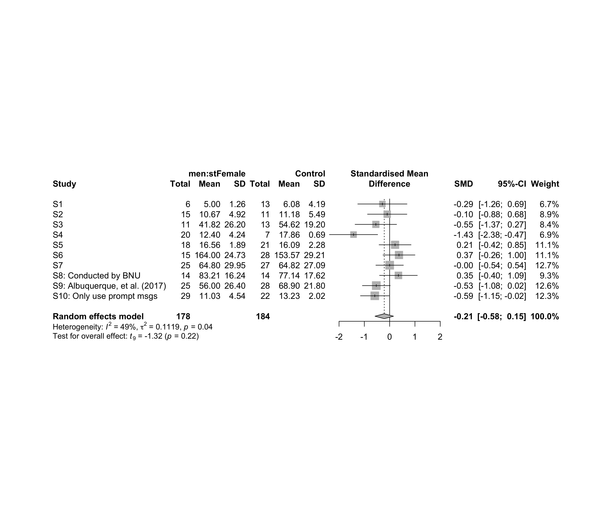
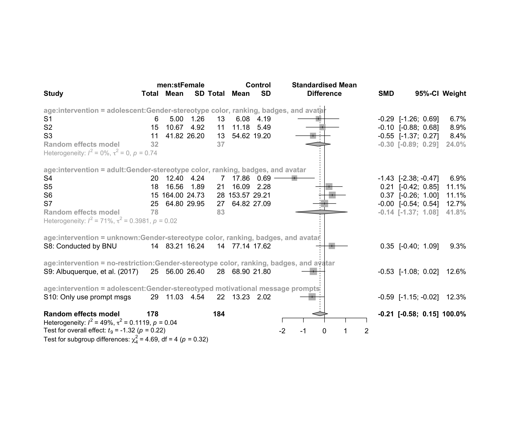

Metanalysis of performance on men caused by (`stFemale`)
================
Geiser C. Challco <geiser@alumni.usp.br>

-   [Initial Variables and Loading
    Data](#initial-variables-and-loading-data)
-   [Perform meta-analyses](#perform-meta-analyses)
    -   [Subgroup analysis by “country”](#subgroup-analysis-by-country)
    -   [Subgroup analysis by “age”](#subgroup-analysis-by-age)
    -   [Subgroup analysis by “ed.level”](#subgroup-analysis-by-edlevel)
    -   [Subgroup analysis by
        “intervention”](#subgroup-analysis-by-intervention)
    -   [Subgroup analysis by
        “country:age”](#subgroup-analysis-by-countryage)
    -   [Subgroup analysis by
        “country:ed.level”](#subgroup-analysis-by-countryedlevel)
    -   [Subgroup analysis by
        “country:intervention”](#subgroup-analysis-by-countryintervention)
    -   [Subgroup analysis by
        “age:intervention”](#subgroup-analysis-by-ageintervention)
    -   [Subgroup analysis by
        “ed.level:intervention”](#subgroup-analysis-by-edlevelintervention)
    -   [Subgroup analysis by
        “country:age:intervention”](#subgroup-analysis-by-countryageintervention)
    -   [Subgroup analysis by
        “country:ed.level:intervention”](#subgroup-analysis-by-countryedlevelintervention)
-   [Funnel Plot](#funnel-plot)

## Initial Variables and Loading Data

``` r
env <- "stFemale"
gender <- "men"
to_remove <- c('S11')
sub.groups <- c("country","age","ed.level","intervention",
                "country:age","country:ed.level","country:intervention",
                "age:intervention","ed.level:intervention",
                "country:age:intervention","country:ed.level:intervention")
```

``` r
dat <- read_excel("../data/data-without-outliers.xlsx", sheet = "perform-env.gender-descriptive")
dat <- dat[!dat$study %in% to_remove, ]

leg <- read_excel("../data/data-without-outliers.xlsx", sheet = "legend")
```

    ## New names:
    ## • `` -> `...10`

``` r
leg <- leg[!leg$study %in% to_remove, ]

idx.e <- which(dat$env == env & dat$gender == gender)
idx.c <- which(dat$env == "control" & dat$gender == gender)

data <- data.frame(
  study = dat$study[idx.c],
  n.e = dat$N[idx.e], mean.e = dat$M[idx.e], sd.e = dat$SD[idx.e],
  n.c = dat$N[idx.c], mean.c = dat$M[idx.c], sd.c = dat$SD[idx.c]
)
for (cgroups in strsplit(sub.groups,":")) {
  data[[paste0(cgroups, collapse = ":")]] <- sapply(data$study, FUN = function(x) {
    paste0(sapply(cgroups, FUN = function(namecol) leg[[namecol]][which(x == leg$study)]), collapse = ":")
  })
}
data[["lbl"]] <- sapply(data$study, FUN = function(x) leg$Note[which(x == leg$study)])
```

## Perform meta-analyses

``` r
m.cont <- metacont(
  n.e = n.e, mean.e = mean.e, sd.e = sd.e, n.c = n.c, mean.c = mean.c, sd.c = sd.c,
  studlab = lbl, data = data, sm = "SMD", method.smd = "Hedges",
  fixed = F, random = T, method.tau = "REML", hakn = T, title = paste("Performance for",gender,"in",env)
)
summary(m.cont)
```

    ## Review:     Performance for men in stFemale
    ## 
    ##                                    SMD             95%-CI %W(random)
    ## S1                             -0.2867 [-1.2593;  0.6860]        6.7
    ## S2                             -0.0965 [-0.8750;  0.6820]        8.9
    ## S3                             -0.5455 [-1.3658;  0.2749]        8.4
    ## S4                             -1.4272 [-2.3807; -0.4738]        6.9
    ## S5                              0.2143 [-0.4172;  0.8459]       11.1
    ## S6                              0.3687 [-0.2637;  1.0011]       11.1
    ## S7                             -0.0005 [-0.5445;  0.5435]       12.7
    ## S8: Conducted by BNU            0.3478 [-0.3995;  1.0950]        9.3
    ## S9: Albuquerque, et al. (2017) -0.5279 [-1.0772;  0.0214]       12.6
    ## S10: Only use prompt msgs      -0.5871 [-1.1538; -0.0205]       12.3
    ## 
    ## Number of studies combined: k = 10
    ## Number of observations: o = 362
    ## 
    ##                          SMD            95%-CI     t p-value
    ## Random effects model -0.2131 [-0.5787; 0.1524] -1.32  0.2198
    ## 
    ## Quantifying heterogeneity:
    ##  tau^2 = 0.1119 [0.0000; 0.8282]; tau = 0.3344 [0.0000; 0.9100]
    ##  I^2 = 49.0% [0.0%; 75.3%]; H = 1.40 [1.00; 2.01]
    ## 
    ## Test of heterogeneity:
    ##      Q d.f. p-value
    ##  17.65    9  0.0395
    ## 
    ## Details on meta-analytical method:
    ## - Inverse variance method
    ## - Restricted maximum-likelihood estimator for tau^2
    ## - Q-profile method for confidence interval of tau^2 and tau
    ## - Hartung-Knapp adjustment for random effects model
    ## - Hedges' g (bias corrected standardised mean difference; using exact formulae)

``` r
forest(m.cont, digits=2, digits.sd = 2, test.overall = T, label.e = paste0(gender,':',env))
```

<!-- -->

### Subgroup analysis by “country”

``` r
m.sg4sub <- update.meta(m.cont, subgroup = country, random = T, fixed = F)
summary(m.sg4sub)
```

    ## Review:     Performance for men in stFemale
    ## 
    ##                                    SMD             95%-CI %W(random) country
    ## S1                             -0.2867 [-1.2593;  0.6860]        6.7  Brazil
    ## S2                             -0.0965 [-0.8750;  0.6820]        8.9  Brazil
    ## S3                             -0.5455 [-1.3658;  0.2749]        8.4  Brazil
    ## S4                             -1.4272 [-2.3807; -0.4738]        6.9  Brazil
    ## S5                              0.2143 [-0.4172;  0.8459]       11.1  Brazil
    ## S6                              0.3687 [-0.2637;  1.0011]       11.1  Brazil
    ## S7                             -0.0005 [-0.5445;  0.5435]       12.7  Brazil
    ## S8: Conducted by BNU            0.3478 [-0.3995;  1.0950]        9.3   China
    ## S9: Albuquerque, et al. (2017) -0.5279 [-1.0772;  0.0214]       12.6  Brazil
    ## S10: Only use prompt msgs      -0.5871 [-1.1538; -0.0205]       12.3  Brazil
    ## 
    ## Number of studies combined: k = 10
    ## Number of observations: o = 362
    ## 
    ##                          SMD            95%-CI     t p-value
    ## Random effects model -0.2131 [-0.5787; 0.1524] -1.32  0.2198
    ## 
    ## Quantifying heterogeneity:
    ##  tau^2 = 0.1119 [0.0000; 0.8282]; tau = 0.3344 [0.0000; 0.9100]
    ##  I^2 = 49.0% [0.0%; 75.3%]; H = 1.40 [1.00; 2.01]
    ## 
    ## Test of heterogeneity:
    ##      Q d.f. p-value
    ##  17.65    9  0.0395
    ## 
    ## Results for subgroups (random effects model):
    ##                    k     SMD            95%-CI  tau^2    tau     Q   I^2
    ## country = Brazil   9 -0.2700 [-0.6548; 0.1149] 0.1063 0.3260 15.41 48.1%
    ## country = China    1  0.3478 [-0.3995; 1.0950]     --     --  0.00    --
    ## 
    ## Test for subgroup differences (random effects model):
    ##                     Q d.f. p-value
    ## Between groups   2.20    1  0.1377
    ## 
    ## Details on meta-analytical method:
    ## - Inverse variance method
    ## - Restricted maximum-likelihood estimator for tau^2
    ## - Q-profile method for confidence interval of tau^2 and tau
    ## - Hartung-Knapp adjustment for random effects model
    ## - Hedges' g (bias corrected standardised mean difference; using exact formulae)

``` r
forest(m.sg4sub, digits=2, digits.sd = 2, test.overall = T, label.e = paste0(gender,':',env))
```

<!-- -->

### Subgroup analysis by “age”

``` r
m.sg4sub <- update.meta(m.cont, subgroup = age, random = T, fixed = F)
summary(m.sg4sub)
```

    ## Review:     Performance for men in stFemale
    ## 
    ##                                    SMD             95%-CI %W(random)            age
    ## S1                             -0.2867 [-1.2593;  0.6860]        6.7     adolescent
    ## S2                             -0.0965 [-0.8750;  0.6820]        8.9     adolescent
    ## S3                             -0.5455 [-1.3658;  0.2749]        8.4     adolescent
    ## S4                             -1.4272 [-2.3807; -0.4738]        6.9          adult
    ## S5                              0.2143 [-0.4172;  0.8459]       11.1          adult
    ## S6                              0.3687 [-0.2637;  1.0011]       11.1          adult
    ## S7                             -0.0005 [-0.5445;  0.5435]       12.7          adult
    ## S8: Conducted by BNU            0.3478 [-0.3995;  1.0950]        9.3        unknown
    ## S9: Albuquerque, et al. (2017) -0.5279 [-1.0772;  0.0214]       12.6 no-restriction
    ## S10: Only use prompt msgs      -0.5871 [-1.1538; -0.0205]       12.3     adolescent
    ## 
    ## Number of studies combined: k = 10
    ## Number of observations: o = 362
    ## 
    ##                          SMD            95%-CI     t p-value
    ## Random effects model -0.2131 [-0.5787; 0.1524] -1.32  0.2198
    ## 
    ## Quantifying heterogeneity:
    ##  tau^2 = 0.1119 [0.0000; 0.8282]; tau = 0.3344 [0.0000; 0.9100]
    ##  I^2 = 49.0% [0.0%; 75.3%]; H = 1.40 [1.00; 2.01]
    ## 
    ## Test of heterogeneity:
    ##      Q d.f. p-value
    ##  17.65    9  0.0395
    ## 
    ## Results for subgroups (random effects model):
    ##                        k     SMD             95%-CI  tau^2    tau     Q   I^2
    ## age = adolescent       4 -0.4244 [-0.7977; -0.0511]      0      0  1.16  0.0%
    ## age = adult            4 -0.1420 [-1.3689;  1.0848] 0.3981 0.6310 10.35 71.0%
    ## age = unknown          1  0.3478 [-0.3995;  1.0950]     --     --  0.00    --
    ## age = no-restriction   1 -0.5279 [-1.0772;  0.0214]     --     --  0.00    --
    ## 
    ## Test for subgroup differences (random effects model):
    ##                     Q d.f. p-value
    ## Between groups   4.42    3  0.2192
    ## 
    ## Details on meta-analytical method:
    ## - Inverse variance method
    ## - Restricted maximum-likelihood estimator for tau^2
    ## - Q-profile method for confidence interval of tau^2 and tau
    ## - Hartung-Knapp adjustment for random effects model
    ## - Hedges' g (bias corrected standardised mean difference; using exact formulae)

``` r
forest(m.sg4sub, digits=2, digits.sd = 2, test.overall = T, label.e = paste0(gender,':',env))
```

<!-- -->

### Subgroup analysis by “ed.level”

``` r
m.sg4sub <- update.meta(m.cont, subgroup = ed.level, random = T, fixed = F)
summary(m.sg4sub)
```

    ## Review:     Performance for men in stFemale
    ## 
    ##                                    SMD             95%-CI %W(random)         ed.level
    ## S1                             -0.2867 [-1.2593;  0.6860]        6.7  upper-secundary
    ## S2                             -0.0965 [-0.8750;  0.6820]        8.9  upper-secundary
    ## S3                             -0.5455 [-1.3658;  0.2749]        8.4  upper-secundary
    ## S4                             -1.4272 [-2.3807; -0.4738]        6.9 higher-education
    ## S5                              0.2143 [-0.4172;  0.8459]       11.1 higher-education
    ## S6                              0.3687 [-0.2637;  1.0011]       11.1 higher-education
    ## S7                             -0.0005 [-0.5445;  0.5435]       12.7          unknown
    ## S8: Conducted by BNU            0.3478 [-0.3995;  1.0950]        9.3          unknown
    ## S9: Albuquerque, et al. (2017) -0.5279 [-1.0772;  0.0214]       12.6          unknown
    ## S10: Only use prompt msgs      -0.5871 [-1.1538; -0.0205]       12.3  upper-secundary
    ## 
    ## Number of studies combined: k = 10
    ## Number of observations: o = 362
    ## 
    ##                          SMD            95%-CI     t p-value
    ## Random effects model -0.2131 [-0.5787; 0.1524] -1.32  0.2198
    ## 
    ## Quantifying heterogeneity:
    ##  tau^2 = 0.1119 [0.0000; 0.8282]; tau = 0.3344 [0.0000; 0.9100]
    ##  I^2 = 49.0% [0.0%; 75.3%]; H = 1.40 [1.00; 2.01]
    ## 
    ## Test of heterogeneity:
    ##      Q d.f. p-value
    ##  17.65    9  0.0395
    ## 
    ## Results for subgroups (random effects model):
    ##                               k     SMD             95%-CI  tau^2    tau     Q   I^2
    ## ed.level = upper-secundary    4 -0.4244 [-0.7977; -0.0511]      0      0  1.16  0.0%
    ## ed.level = higher-education   3 -0.2277 [-2.6367;  2.1813] 0.7507 0.8664 10.35 80.7%
    ## ed.level = unknown            3 -0.1035 [-1.1720;  0.9651] 0.0854 0.2922  3.80 47.4%
    ## 
    ## Test for subgroup differences (random effects model):
    ##                     Q d.f. p-value
    ## Between groups   1.42    2  0.4906
    ## 
    ## Details on meta-analytical method:
    ## - Inverse variance method
    ## - Restricted maximum-likelihood estimator for tau^2
    ## - Q-profile method for confidence interval of tau^2 and tau
    ## - Hartung-Knapp adjustment for random effects model
    ## - Hedges' g (bias corrected standardised mean difference; using exact formulae)

``` r
forest(m.sg4sub, digits=2, digits.sd = 2, test.overall = T, label.e = paste0(gender,':',env))
```

<!-- -->

### Subgroup analysis by “intervention”

``` r
m.sg4sub <- update.meta(m.cont, subgroup = intervention, random = T, fixed = F)
summary(m.sg4sub)
```

    ## Review:     Performance for men in stFemale
    ## 
    ##                                    SMD             95%-CI %W(random)
    ## S1                             -0.2867 [-1.2593;  0.6860]        6.7
    ## S2                             -0.0965 [-0.8750;  0.6820]        8.9
    ## S3                             -0.5455 [-1.3658;  0.2749]        8.4
    ## S4                             -1.4272 [-2.3807; -0.4738]        6.9
    ## S5                              0.2143 [-0.4172;  0.8459]       11.1
    ## S6                              0.3687 [-0.2637;  1.0011]       11.1
    ## S7                             -0.0005 [-0.5445;  0.5435]       12.7
    ## S8: Conducted by BNU            0.3478 [-0.3995;  1.0950]        9.3
    ## S9: Albuquerque, et al. (2017) -0.5279 [-1.0772;  0.0214]       12.6
    ## S10: Only use prompt msgs      -0.5871 [-1.1538; -0.0205]       12.3
    ##                                                                        intervention
    ## S1                             Gender-stereotype color, ranking, badges, and avatar
    ## S2                             Gender-stereotype color, ranking, badges, and avatar
    ## S3                             Gender-stereotype color, ranking, badges, and avatar
    ## S4                             Gender-stereotype color, ranking, badges, and avatar
    ## S5                             Gender-stereotype color, ranking, badges, and avatar
    ## S6                             Gender-stereotype color, ranking, badges, and avatar
    ## S7                             Gender-stereotype color, ranking, badges, and avatar
    ## S8: Conducted by BNU           Gender-stereotype color, ranking, badges, and avatar
    ## S9: Albuquerque, et al. (2017) Gender-stereotype color, ranking, badges, and avatar
    ## S10: Only use prompt msgs           Gender-stereotyped motivational message prompts
    ## 
    ## Number of studies combined: k = 10
    ## Number of observations: o = 362
    ## 
    ##                          SMD            95%-CI     t p-value
    ## Random effects model -0.2131 [-0.5787; 0.1524] -1.32  0.2198
    ## 
    ## Quantifying heterogeneity:
    ##  tau^2 = 0.1119 [0.0000; 0.8282]; tau = 0.3344 [0.0000; 0.9100]
    ##  I^2 = 49.0% [0.0%; 75.3%]; H = 1.40 [1.00; 2.01]
    ## 
    ## Test of heterogeneity:
    ##      Q d.f. p-value
    ##  17.65    9  0.0395
    ## 
    ## Results for subgroups (random effects model):
    ##                                                      k     SMD             95%-CI  tau^2    tau     Q   I^2
    ## intervention = Gender-stereotype color, rankin ...   9 -0.1612 [-0.5655;  0.2432] 0.1143 0.3380 15.54 48.5%
    ## intervention = Gender-stereotyped motivational ...   1 -0.5871 [-1.1538; -0.0205]     --     --  0.00    --
    ## 
    ## Test for subgroup differences (random effects model):
    ##                     Q d.f. p-value
    ## Between groups   1.59    1  0.2078
    ## 
    ## Details on meta-analytical method:
    ## - Inverse variance method
    ## - Restricted maximum-likelihood estimator for tau^2
    ## - Q-profile method for confidence interval of tau^2 and tau
    ## - Hartung-Knapp adjustment for random effects model
    ## - Hedges' g (bias corrected standardised mean difference; using exact formulae)

``` r
forest(m.sg4sub, digits=2, digits.sd = 2, test.overall = T, label.e = paste0(gender,':',env))
```

<!-- -->

### Subgroup analysis by “country:age”

``` r
m.sg4sub <- update.meta(m.cont, subgroup = `country:age`, random = T, fixed = F)
summary(m.sg4sub)
```

    ## Review:     Performance for men in stFemale
    ## 
    ##                                    SMD             95%-CI %W(random)           country:age
    ## S1                             -0.2867 [-1.2593;  0.6860]        6.7     Brazil:adolescent
    ## S2                             -0.0965 [-0.8750;  0.6820]        8.9     Brazil:adolescent
    ## S3                             -0.5455 [-1.3658;  0.2749]        8.4     Brazil:adolescent
    ## S4                             -1.4272 [-2.3807; -0.4738]        6.9          Brazil:adult
    ## S5                              0.2143 [-0.4172;  0.8459]       11.1          Brazil:adult
    ## S6                              0.3687 [-0.2637;  1.0011]       11.1          Brazil:adult
    ## S7                             -0.0005 [-0.5445;  0.5435]       12.7          Brazil:adult
    ## S8: Conducted by BNU            0.3478 [-0.3995;  1.0950]        9.3         China:unknown
    ## S9: Albuquerque, et al. (2017) -0.5279 [-1.0772;  0.0214]       12.6 Brazil:no-restriction
    ## S10: Only use prompt msgs      -0.5871 [-1.1538; -0.0205]       12.3     Brazil:adolescent
    ## 
    ## Number of studies combined: k = 10
    ## Number of observations: o = 362
    ## 
    ##                          SMD            95%-CI     t p-value
    ## Random effects model -0.2131 [-0.5787; 0.1524] -1.32  0.2198
    ## 
    ## Quantifying heterogeneity:
    ##  tau^2 = 0.1119 [0.0000; 0.8282]; tau = 0.3344 [0.0000; 0.9100]
    ##  I^2 = 49.0% [0.0%; 75.3%]; H = 1.40 [1.00; 2.01]
    ## 
    ## Test of heterogeneity:
    ##      Q d.f. p-value
    ##  17.65    9  0.0395
    ## 
    ## Results for subgroups (random effects model):
    ##                                       k     SMD             95%-CI  tau^2    tau     Q   I^2
    ## country:age = Brazil:adolescent       4 -0.4244 [-0.7977; -0.0511]      0      0  1.16  0.0%
    ## country:age = Brazil:adult            4 -0.1420 [-1.3689;  1.0848] 0.3981 0.6310 10.35 71.0%
    ## country:age = China:unknown           1  0.3478 [-0.3995;  1.0950]     --     --  0.00    --
    ## country:age = Brazil:no-restriction   1 -0.5279 [-1.0772;  0.0214]     --     --  0.00    --
    ## 
    ## Test for subgroup differences (random effects model):
    ##                     Q d.f. p-value
    ## Between groups   4.42    3  0.2192
    ## 
    ## Details on meta-analytical method:
    ## - Inverse variance method
    ## - Restricted maximum-likelihood estimator for tau^2
    ## - Q-profile method for confidence interval of tau^2 and tau
    ## - Hartung-Knapp adjustment for random effects model
    ## - Hedges' g (bias corrected standardised mean difference; using exact formulae)

``` r
forest(m.sg4sub, digits=2, digits.sd = 2, test.overall = T, label.e = paste0(gender,':',env))
```

<!-- -->

### Subgroup analysis by “country:ed.level”

``` r
m.sg4sub <- update.meta(m.cont, subgroup = `country:ed.level`, random = T, fixed = F)
summary(m.sg4sub)
```

    ## Review:     Performance for men in stFemale
    ## 
    ##                                    SMD             95%-CI %W(random)        country:ed.level
    ## S1                             -0.2867 [-1.2593;  0.6860]        6.7  Brazil:upper-secundary
    ## S2                             -0.0965 [-0.8750;  0.6820]        8.9  Brazil:upper-secundary
    ## S3                             -0.5455 [-1.3658;  0.2749]        8.4  Brazil:upper-secundary
    ## S4                             -1.4272 [-2.3807; -0.4738]        6.9 Brazil:higher-education
    ## S5                              0.2143 [-0.4172;  0.8459]       11.1 Brazil:higher-education
    ## S6                              0.3687 [-0.2637;  1.0011]       11.1 Brazil:higher-education
    ## S7                             -0.0005 [-0.5445;  0.5435]       12.7          Brazil:unknown
    ## S8: Conducted by BNU            0.3478 [-0.3995;  1.0950]        9.3           China:unknown
    ## S9: Albuquerque, et al. (2017) -0.5279 [-1.0772;  0.0214]       12.6          Brazil:unknown
    ## S10: Only use prompt msgs      -0.5871 [-1.1538; -0.0205]       12.3  Brazil:upper-secundary
    ## 
    ## Number of studies combined: k = 10
    ## Number of observations: o = 362
    ## 
    ##                          SMD            95%-CI     t p-value
    ## Random effects model -0.2131 [-0.5787; 0.1524] -1.32  0.2198
    ## 
    ## Quantifying heterogeneity:
    ##  tau^2 = 0.1119 [0.0000; 0.8282]; tau = 0.3344 [0.0000; 0.9100]
    ##  I^2 = 49.0% [0.0%; 75.3%]; H = 1.40 [1.00; 2.01]
    ## 
    ## Test of heterogeneity:
    ##      Q d.f. p-value
    ##  17.65    9  0.0395
    ## 
    ## Results for subgroups (random effects model):
    ##                                              k     SMD             95%-CI  tau^2    tau     Q   I^2
    ## country:ed.level = Brazil:upper-secundary    4 -0.4244 [-0.7977; -0.0511]      0      0  1.16  0.0%
    ## country:ed.level = Brazil:higher-education   3 -0.2277 [-2.6367;  2.1813] 0.7507 0.8664 10.35 80.7%
    ## country:ed.level = Brazil:unknown            2 -0.2628 [-3.6133;  3.0878] 0.0613 0.2476  1.79 44.1%
    ## country:ed.level = China:unknown             1  0.3478 [-0.3995;  1.0950]     --     --  0.00    --
    ## 
    ## Test for subgroup differences (random effects model):
    ##                     Q d.f. p-value
    ## Between groups   3.90    3  0.2727
    ## 
    ## Details on meta-analytical method:
    ## - Inverse variance method
    ## - Restricted maximum-likelihood estimator for tau^2
    ## - Q-profile method for confidence interval of tau^2 and tau
    ## - Hartung-Knapp adjustment for random effects model
    ## - Hedges' g (bias corrected standardised mean difference; using exact formulae)

``` r
forest(m.sg4sub, digits=2, digits.sd = 2, test.overall = T, label.e = paste0(gender,':',env))
```

<!-- -->

### Subgroup analysis by “country:intervention”

``` r
m.sg4sub <- update.meta(m.cont, subgroup = `country:intervention`, random = T, fixed = F)
summary(m.sg4sub)
```

    ## Review:     Performance for men in stFemale
    ## 
    ##                                    SMD             95%-CI %W(random)
    ## S1                             -0.2867 [-1.2593;  0.6860]        6.7
    ## S2                             -0.0965 [-0.8750;  0.6820]        8.9
    ## S3                             -0.5455 [-1.3658;  0.2749]        8.4
    ## S4                             -1.4272 [-2.3807; -0.4738]        6.9
    ## S5                              0.2143 [-0.4172;  0.8459]       11.1
    ## S6                              0.3687 [-0.2637;  1.0011]       11.1
    ## S7                             -0.0005 [-0.5445;  0.5435]       12.7
    ## S8: Conducted by BNU            0.3478 [-0.3995;  1.0950]        9.3
    ## S9: Albuquerque, et al. (2017) -0.5279 [-1.0772;  0.0214]       12.6
    ## S10: Only use prompt msgs      -0.5871 [-1.1538; -0.0205]       12.3
    ##                                                                       country:intervention
    ## S1                             Brazil:Gender-stereotype color, ranking, badges, and avatar
    ## S2                             Brazil:Gender-stereotype color, ranking, badges, and avatar
    ## S3                             Brazil:Gender-stereotype color, ranking, badges, and avatar
    ## S4                             Brazil:Gender-stereotype color, ranking, badges, and avatar
    ## S5                             Brazil:Gender-stereotype color, ranking, badges, and avatar
    ## S6                             Brazil:Gender-stereotype color, ranking, badges, and avatar
    ## S7                             Brazil:Gender-stereotype color, ranking, badges, and avatar
    ## S8: Conducted by BNU            China:Gender-stereotype color, ranking, badges, and avatar
    ## S9: Albuquerque, et al. (2017) Brazil:Gender-stereotype color, ranking, badges, and avatar
    ## S10: Only use prompt msgs           Brazil:Gender-stereotyped motivational message prompts
    ## 
    ## Number of studies combined: k = 10
    ## Number of observations: o = 362
    ## 
    ##                          SMD            95%-CI     t p-value
    ## Random effects model -0.2131 [-0.5787; 0.1524] -1.32  0.2198
    ## 
    ## Quantifying heterogeneity:
    ##  tau^2 = 0.1119 [0.0000; 0.8282]; tau = 0.3344 [0.0000; 0.9100]
    ##  I^2 = 49.0% [0.0%; 75.3%]; H = 1.40 [1.00; 2.01]
    ## 
    ## Test of heterogeneity:
    ##      Q d.f. p-value
    ##  17.65    9  0.0395
    ## 
    ## Results for subgroups (random effects model):
    ##                                                              k     SMD             95%-CI  tau^2    tau
    ## country:intervention = Brazil:Gender-stereotype color, ...   8 -0.2226 [-0.6616;  0.2164] 0.1182 0.3438
    ## country:intervention = China:Gender-stereotype color,  ...   1  0.3478 [-0.3995;  1.0950]     --     --
    ## country:intervention = Brazil:Gender-stereotyped motiv ...   1 -0.5871 [-1.1538; -0.0205]     --     --
    ##                                                                Q   I^2
    ## country:intervention = Brazil:Gender-stereotype color, ... 13.77 49.2%
    ## country:intervention = China:Gender-stereotype color,  ...  0.00    --
    ## country:intervention = Brazil:Gender-stereotyped motiv ...  0.00    --
    ## 
    ## Test for subgroup differences (random effects model):
    ##                     Q d.f. p-value
    ## Between groups   3.82    2  0.1478
    ## 
    ## Details on meta-analytical method:
    ## - Inverse variance method
    ## - Restricted maximum-likelihood estimator for tau^2
    ## - Q-profile method for confidence interval of tau^2 and tau
    ## - Hartung-Knapp adjustment for random effects model
    ## - Hedges' g (bias corrected standardised mean difference; using exact formulae)

``` r
forest(m.sg4sub, digits=2, digits.sd = 2, test.overall = T, label.e = paste0(gender,':',env))
```

<!-- -->

### Subgroup analysis by “age:intervention”

``` r
m.sg4sub <- update.meta(m.cont, subgroup = `age:intervention`, random = T, fixed = F)
summary(m.sg4sub)
```

    ## Review:     Performance for men in stFemale
    ## 
    ##                                    SMD             95%-CI %W(random)
    ## S1                             -0.2867 [-1.2593;  0.6860]        6.7
    ## S2                             -0.0965 [-0.8750;  0.6820]        8.9
    ## S3                             -0.5455 [-1.3658;  0.2749]        8.4
    ## S4                             -1.4272 [-2.3807; -0.4738]        6.9
    ## S5                              0.2143 [-0.4172;  0.8459]       11.1
    ## S6                              0.3687 [-0.2637;  1.0011]       11.1
    ## S7                             -0.0005 [-0.5445;  0.5435]       12.7
    ## S8: Conducted by BNU            0.3478 [-0.3995;  1.0950]        9.3
    ## S9: Albuquerque, et al. (2017) -0.5279 [-1.0772;  0.0214]       12.6
    ## S10: Only use prompt msgs      -0.5871 [-1.1538; -0.0205]       12.3
    ##                                                                                   age:intervention
    ## S1                                 adolescent:Gender-stereotype color, ranking, badges, and avatar
    ## S2                                 adolescent:Gender-stereotype color, ranking, badges, and avatar
    ## S3                                 adolescent:Gender-stereotype color, ranking, badges, and avatar
    ## S4                                      adult:Gender-stereotype color, ranking, badges, and avatar
    ## S5                                      adult:Gender-stereotype color, ranking, badges, and avatar
    ## S6                                      adult:Gender-stereotype color, ranking, badges, and avatar
    ## S7                                      adult:Gender-stereotype color, ranking, badges, and avatar
    ## S8: Conducted by BNU                  unknown:Gender-stereotype color, ranking, badges, and avatar
    ## S9: Albuquerque, et al. (2017) no-restriction:Gender-stereotype color, ranking, badges, and avatar
    ## S10: Only use prompt msgs               adolescent:Gender-stereotyped motivational message prompts
    ## 
    ## Number of studies combined: k = 10
    ## Number of observations: o = 362
    ## 
    ##                          SMD            95%-CI     t p-value
    ## Random effects model -0.2131 [-0.5787; 0.1524] -1.32  0.2198
    ## 
    ## Quantifying heterogeneity:
    ##  tau^2 = 0.1119 [0.0000; 0.8282]; tau = 0.3344 [0.0000; 0.9100]
    ##  I^2 = 49.0% [0.0%; 75.3%]; H = 1.40 [1.00; 2.01]
    ## 
    ## Test of heterogeneity:
    ##      Q d.f. p-value
    ##  17.65    9  0.0395
    ## 
    ## Results for subgroups (random effects model):
    ##                                                          k     SMD             95%-CI  tau^2    tau     Q
    ## age:intervention = adolescent:Gender-stereotype co ...   3 -0.3036 [-0.8941;  0.2870]      0      0  0.61
    ## age:intervention = adult:Gender-stereotype color,  ...   4 -0.1420 [-1.3689;  1.0848] 0.3981 0.6310 10.35
    ## age:intervention = unknown:Gender-stereotype color ...   1  0.3478 [-0.3995;  1.0950]     --     --  0.00
    ## age:intervention = no-restriction:Gender-stereotyp ...   1 -0.5279 [-1.0772;  0.0214]     --     --  0.00
    ## age:intervention = adolescent:Gender-stereotyped m ...   1 -0.5871 [-1.1538; -0.0205]     --     --  0.00
    ##                                                          I^2
    ## age:intervention = adolescent:Gender-stereotype co ...  0.0%
    ## age:intervention = adult:Gender-stereotype color,  ... 71.0%
    ## age:intervention = unknown:Gender-stereotype color ...    --
    ## age:intervention = no-restriction:Gender-stereotyp ...    --
    ## age:intervention = adolescent:Gender-stereotyped m ...    --
    ## 
    ## Test for subgroup differences (random effects model):
    ##                     Q d.f. p-value
    ## Between groups   4.69    4  0.3204
    ## 
    ## Details on meta-analytical method:
    ## - Inverse variance method
    ## - Restricted maximum-likelihood estimator for tau^2
    ## - Q-profile method for confidence interval of tau^2 and tau
    ## - Hartung-Knapp adjustment for random effects model
    ## - Hedges' g (bias corrected standardised mean difference; using exact formulae)

``` r
forest(m.sg4sub, digits=2, digits.sd = 2, test.overall = T, label.e = paste0(gender,':',env))
```

<!-- -->

### Subgroup analysis by “ed.level:intervention”

``` r
m.sg4sub <- update.meta(m.cont, subgroup = `ed.level:intervention`, random = T, fixed = F)
summary(m.sg4sub)
```

    ## Review:     Performance for men in stFemale
    ## 
    ##                                    SMD             95%-CI %W(random)
    ## S1                             -0.2867 [-1.2593;  0.6860]        6.7
    ## S2                             -0.0965 [-0.8750;  0.6820]        8.9
    ## S3                             -0.5455 [-1.3658;  0.2749]        8.4
    ## S4                             -1.4272 [-2.3807; -0.4738]        6.9
    ## S5                              0.2143 [-0.4172;  0.8459]       11.1
    ## S6                              0.3687 [-0.2637;  1.0011]       11.1
    ## S7                             -0.0005 [-0.5445;  0.5435]       12.7
    ## S8: Conducted by BNU            0.3478 [-0.3995;  1.0950]        9.3
    ## S9: Albuquerque, et al. (2017) -0.5279 [-1.0772;  0.0214]       12.6
    ## S10: Only use prompt msgs      -0.5871 [-1.1538; -0.0205]       12.3
    ##                                                                                ed.level:intervention
    ## S1                              upper-secundary:Gender-stereotype color, ranking, badges, and avatar
    ## S2                              upper-secundary:Gender-stereotype color, ranking, badges, and avatar
    ## S3                              upper-secundary:Gender-stereotype color, ranking, badges, and avatar
    ## S4                             higher-education:Gender-stereotype color, ranking, badges, and avatar
    ## S5                             higher-education:Gender-stereotype color, ranking, badges, and avatar
    ## S6                             higher-education:Gender-stereotype color, ranking, badges, and avatar
    ## S7                                      unknown:Gender-stereotype color, ranking, badges, and avatar
    ## S8: Conducted by BNU                    unknown:Gender-stereotype color, ranking, badges, and avatar
    ## S9: Albuquerque, et al. (2017)          unknown:Gender-stereotype color, ranking, badges, and avatar
    ## S10: Only use prompt msgs            upper-secundary:Gender-stereotyped motivational message prompts
    ## 
    ## Number of studies combined: k = 10
    ## Number of observations: o = 362
    ## 
    ##                          SMD            95%-CI     t p-value
    ## Random effects model -0.2131 [-0.5787; 0.1524] -1.32  0.2198
    ## 
    ## Quantifying heterogeneity:
    ##  tau^2 = 0.1119 [0.0000; 0.8282]; tau = 0.3344 [0.0000; 0.9100]
    ##  I^2 = 49.0% [0.0%; 75.3%]; H = 1.40 [1.00; 2.01]
    ## 
    ## Test of heterogeneity:
    ##      Q d.f. p-value
    ##  17.65    9  0.0395
    ## 
    ## Results for subgroups (random effects model):
    ##                                                               k     SMD             95%-CI  tau^2    tau
    ## ed.level:intervention = upper-secundary:Gender-stereoty ...   3 -0.3036 [-0.8941;  0.2870]      0      0
    ## ed.level:intervention = higher-education:Gender-stereot ...   3 -0.2277 [-2.6367;  2.1813] 0.7507 0.8664
    ## ed.level:intervention = unknown:Gender-stereotype color ...   3 -0.1035 [-1.1720;  0.9651] 0.0854 0.2922
    ## ed.level:intervention = upper-secundary:Gender-stereoty ...   1 -0.5871 [-1.1538; -0.0205]     --     --
    ##                                                                 Q   I^2
    ## ed.level:intervention = upper-secundary:Gender-stereoty ...  0.61  0.0%
    ## ed.level:intervention = higher-education:Gender-stereot ... 10.35 80.7%
    ## ed.level:intervention = unknown:Gender-stereotype color ...  3.80 47.4%
    ## ed.level:intervention = upper-secundary:Gender-stereoty ...  0.00    --
    ## 
    ## Test for subgroup differences (random effects model):
    ##                     Q d.f. p-value
    ## Between groups   1.63    3  0.6527
    ## 
    ## Details on meta-analytical method:
    ## - Inverse variance method
    ## - Restricted maximum-likelihood estimator for tau^2
    ## - Q-profile method for confidence interval of tau^2 and tau
    ## - Hartung-Knapp adjustment for random effects model
    ## - Hedges' g (bias corrected standardised mean difference; using exact formulae)

``` r
forest(m.sg4sub, digits=2, digits.sd = 2, test.overall = T, label.e = paste0(gender,':',env))
```

<!-- -->

### Subgroup analysis by “country:age:intervention”

``` r
m.sg4sub <- update.meta(m.cont, subgroup = `country:age:intervention`, random = T, fixed = F)
summary(m.sg4sub)
```

    ## Review:     Performance for men in stFemale
    ## 
    ##                                    SMD             95%-CI %W(random)
    ## S1                             -0.2867 [-1.2593;  0.6860]        6.7
    ## S2                             -0.0965 [-0.8750;  0.6820]        8.9
    ## S3                             -0.5455 [-1.3658;  0.2749]        8.4
    ## S4                             -1.4272 [-2.3807; -0.4738]        6.9
    ## S5                              0.2143 [-0.4172;  0.8459]       11.1
    ## S6                              0.3687 [-0.2637;  1.0011]       11.1
    ## S7                             -0.0005 [-0.5445;  0.5435]       12.7
    ## S8: Conducted by BNU            0.3478 [-0.3995;  1.0950]        9.3
    ## S9: Albuquerque, et al. (2017) -0.5279 [-1.0772;  0.0214]       12.6
    ## S10: Only use prompt msgs      -0.5871 [-1.1538; -0.0205]       12.3
    ##                                                                                  country:age:intervention
    ## S1                                 Brazil:adolescent:Gender-stereotype color, ranking, badges, and avatar
    ## S2                                 Brazil:adolescent:Gender-stereotype color, ranking, badges, and avatar
    ## S3                                 Brazil:adolescent:Gender-stereotype color, ranking, badges, and avatar
    ## S4                                      Brazil:adult:Gender-stereotype color, ranking, badges, and avatar
    ## S5                                      Brazil:adult:Gender-stereotype color, ranking, badges, and avatar
    ## S6                                      Brazil:adult:Gender-stereotype color, ranking, badges, and avatar
    ## S7                                      Brazil:adult:Gender-stereotype color, ranking, badges, and avatar
    ## S8: Conducted by BNU                   China:unknown:Gender-stereotype color, ranking, badges, and avatar
    ## S9: Albuquerque, et al. (2017) Brazil:no-restriction:Gender-stereotype color, ranking, badges, and avatar
    ## S10: Only use prompt msgs               Brazil:adolescent:Gender-stereotyped motivational message prompts
    ## 
    ## Number of studies combined: k = 10
    ## Number of observations: o = 362
    ## 
    ##                          SMD            95%-CI     t p-value
    ## Random effects model -0.2131 [-0.5787; 0.1524] -1.32  0.2198
    ## 
    ## Quantifying heterogeneity:
    ##  tau^2 = 0.1119 [0.0000; 0.8282]; tau = 0.3344 [0.0000; 0.9100]
    ##  I^2 = 49.0% [0.0%; 75.3%]; H = 1.40 [1.00; 2.01]
    ## 
    ## Test of heterogeneity:
    ##      Q d.f. p-value
    ##  17.65    9  0.0395
    ## 
    ## Results for subgroups (random effects model):
    ##                                                                  k     SMD             95%-CI  tau^2    tau
    ## country:age:intervention = Brazil:adolescent:Gender-stereo ...   3 -0.3036 [-0.8941;  0.2870]      0      0
    ## country:age:intervention = Brazil:adult:Gender-stereotype  ...   4 -0.1420 [-1.3689;  1.0848] 0.3981 0.6310
    ## country:age:intervention = China:unknown:Gender-stereotype ...   1  0.3478 [-0.3995;  1.0950]     --     --
    ## country:age:intervention = Brazil:no-restriction:Gender-st ...   1 -0.5279 [-1.0772;  0.0214]     --     --
    ## country:age:intervention = Brazil:adolescent:Gender-stereo ...   1 -0.5871 [-1.1538; -0.0205]     --     --
    ##                                                                    Q   I^2
    ## country:age:intervention = Brazil:adolescent:Gender-stereo ...  0.61  0.0%
    ## country:age:intervention = Brazil:adult:Gender-stereotype  ... 10.35 71.0%
    ## country:age:intervention = China:unknown:Gender-stereotype ...  0.00    --
    ## country:age:intervention = Brazil:no-restriction:Gender-st ...  0.00    --
    ## country:age:intervention = Brazil:adolescent:Gender-stereo ...  0.00    --
    ## 
    ## Test for subgroup differences (random effects model):
    ##                     Q d.f. p-value
    ## Between groups   4.69    4  0.3204
    ## 
    ## Details on meta-analytical method:
    ## - Inverse variance method
    ## - Restricted maximum-likelihood estimator for tau^2
    ## - Q-profile method for confidence interval of tau^2 and tau
    ## - Hartung-Knapp adjustment for random effects model
    ## - Hedges' g (bias corrected standardised mean difference; using exact formulae)

``` r
forest(m.sg4sub, digits=2, digits.sd = 2, test.overall = T, label.e = paste0(gender,':',env))
```

<!-- -->

### Subgroup analysis by “country:ed.level:intervention”

``` r
m.sg4sub <- update.meta(m.cont, subgroup = `country:ed.level:intervention`, random = T, fixed = F)
summary(m.sg4sub)
```

    ## Review:     Performance for men in stFemale
    ## 
    ##                                    SMD             95%-CI %W(random)
    ## S1                             -0.2867 [-1.2593;  0.6860]        6.7
    ## S2                             -0.0965 [-0.8750;  0.6820]        8.9
    ## S3                             -0.5455 [-1.3658;  0.2749]        8.4
    ## S4                             -1.4272 [-2.3807; -0.4738]        6.9
    ## S5                              0.2143 [-0.4172;  0.8459]       11.1
    ## S6                              0.3687 [-0.2637;  1.0011]       11.1
    ## S7                             -0.0005 [-0.5445;  0.5435]       12.7
    ## S8: Conducted by BNU            0.3478 [-0.3995;  1.0950]        9.3
    ## S9: Albuquerque, et al. (2017) -0.5279 [-1.0772;  0.0214]       12.6
    ## S10: Only use prompt msgs      -0.5871 [-1.1538; -0.0205]       12.3
    ##                                                                               country:ed.level:intervention
    ## S1                              Brazil:upper-secundary:Gender-stereotype color, ranking, badges, and avatar
    ## S2                              Brazil:upper-secundary:Gender-stereotype color, ranking, badges, and avatar
    ## S3                              Brazil:upper-secundary:Gender-stereotype color, ranking, badges, and avatar
    ## S4                             Brazil:higher-education:Gender-stereotype color, ranking, badges, and avatar
    ## S5                             Brazil:higher-education:Gender-stereotype color, ranking, badges, and avatar
    ## S6                             Brazil:higher-education:Gender-stereotype color, ranking, badges, and avatar
    ## S7                                      Brazil:unknown:Gender-stereotype color, ranking, badges, and avatar
    ## S8: Conducted by BNU                     China:unknown:Gender-stereotype color, ranking, badges, and avatar
    ## S9: Albuquerque, et al. (2017)          Brazil:unknown:Gender-stereotype color, ranking, badges, and avatar
    ## S10: Only use prompt msgs            Brazil:upper-secundary:Gender-stereotyped motivational message prompts
    ## 
    ## Number of studies combined: k = 10
    ## Number of observations: o = 362
    ## 
    ##                          SMD            95%-CI     t p-value
    ## Random effects model -0.2131 [-0.5787; 0.1524] -1.32  0.2198
    ## 
    ## Quantifying heterogeneity:
    ##  tau^2 = 0.1119 [0.0000; 0.8282]; tau = 0.3344 [0.0000; 0.9100]
    ##  I^2 = 49.0% [0.0%; 75.3%]; H = 1.40 [1.00; 2.01]
    ## 
    ## Test of heterogeneity:
    ##      Q d.f. p-value
    ##  17.65    9  0.0395
    ## 
    ## Results for subgroups (random effects model):
    ##                                                                       k     SMD             95%-CI  tau^2
    ## country:ed.level:intervention = Brazil:upper-secundary:Gender-s ...   3 -0.3036 [-0.8941;  0.2870]      0
    ## country:ed.level:intervention = Brazil:higher-education:Gender- ...   3 -0.2277 [-2.6367;  2.1813] 0.7507
    ## country:ed.level:intervention = Brazil:unknown:Gender-stereotyp ...   2 -0.2628 [-3.6133;  3.0878] 0.0613
    ## country:ed.level:intervention = China:unknown:Gender-stereotype ...   1  0.3478 [-0.3995;  1.0950]     --
    ## country:ed.level:intervention = Brazil:upper-secundary:Gender-s ...   1 -0.5871 [-1.1538; -0.0205]     --
    ##                                                                        tau     Q   I^2
    ## country:ed.level:intervention = Brazil:upper-secundary:Gender-s ...      0  0.61  0.0%
    ## country:ed.level:intervention = Brazil:higher-education:Gender- ... 0.8664 10.35 80.7%
    ## country:ed.level:intervention = Brazil:unknown:Gender-stereotyp ... 0.2476  1.79 44.1%
    ## country:ed.level:intervention = China:unknown:Gender-stereotype ...     --  0.00    --
    ## country:ed.level:intervention = Brazil:upper-secundary:Gender-s ...     --  0.00    --
    ## 
    ## Test for subgroup differences (random effects model):
    ##                     Q d.f. p-value
    ## Between groups   3.88    4  0.4222
    ## 
    ## Details on meta-analytical method:
    ## - Inverse variance method
    ## - Restricted maximum-likelihood estimator for tau^2
    ## - Q-profile method for confidence interval of tau^2 and tau
    ## - Hartung-Knapp adjustment for random effects model
    ## - Hedges' g (bias corrected standardised mean difference; using exact formulae)

``` r
forest(m.sg4sub, digits=2, digits.sd = 2, test.overall = T, label.e = paste0(gender,':',env))
```

<!-- -->

## Funnel Plot

``` r
m.cont <- update.meta(m.cont, studlab = data$study)
summary(eggers.test(x = m.cont))
```

    ## Eggers' test of the intercept 
    ## ============================= 
    ## 
    ##  intercept       95% CI      t    p
    ##     -1.585 -6.11 - 2.94 -0.686 0.51
    ## 
    ## Eggers' test does not indicate the presence of funnel plot asymmetry.

``` r
funnel(m.cont, xlab = "Hedges' g", studlab = T, legend=T, addtau2 = T)
```

<!-- -->
