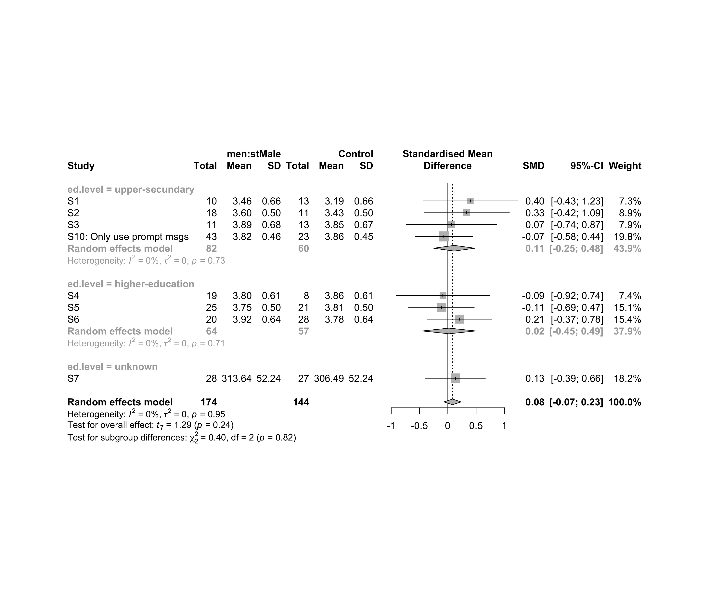

Metanalysis of flow state on men caused by (`stMale`)
================
Geiser C. Challco <geiser@alumni.usp.br>

-   [Initial Variables and Loading
    Data](#initial-variables-and-loading-data)
-   [Perform meta-analyses](#perform-meta-analyses)
    -   [Subgroup analysis by “age”](#subgroup-analysis-by-age)
    -   [Subgroup analysis by “ed.level”](#subgroup-analysis-by-edlevel)
    -   [Subgroup analysis by
        “intervention”](#subgroup-analysis-by-intervention)
    -   [Subgroup analysis by
        “age:intervention”](#subgroup-analysis-by-ageintervention)
    -   [Subgroup analysis by
        “ed.level:intervention”](#subgroup-analysis-by-edlevelintervention)
    -   [Subgroup analysis by
        “age:ed.level:intervention”](#subgroup-analysis-by-ageedlevelintervention)
-   [Funnel Plot](#funnel-plot)

## Initial Variables and Loading Data

``` r
env <- "stMale"
gender <- "men"
to_remove <- c('S11')
sub.groups <- c("age","ed.level","intervention","age:intervention",
                "ed.level:intervention","age:ed.level:intervention")
```

``` r
dat <- read_excel("../data/data-without-outliers.xlsx", sheet = "fss-env.gender-descriptive")
dat <- dat[!dat$study %in% to_remove, ]

leg <- read_excel("../data/data-without-outliers.xlsx", sheet = "legend")
```

    ## New names:
    ## • `` -> `...10`

``` r
leg <- leg[!leg$study %in% to_remove, ]

idx.e <- which(dat$env == env & dat$gender == gender)
idx.c <- which(dat$env == "control" & dat$gender == gender)

data <- data.frame(
  study = dat$study[idx.c],
  n.e = dat$N[idx.e], mean.e = dat$M.emms[idx.e], sd.e = dat$SD.emms[idx.e],
  n.c = dat$N[idx.c], mean.c = dat$M.emms[idx.c], sd.c = dat$SD.emms[idx.c]
)
for (cgroups in strsplit(sub.groups,":")) {
  data[[paste0(cgroups, collapse = ":")]] <- sapply(data$study, FUN = function(x) {
    paste0(sapply(cgroups, FUN = function(namecol) leg[[namecol]][which(x == leg$study)]), collapse = ":")
  })
}
data[["lbl"]] <- sapply(data$study, FUN = function(x) leg$Note[which(x == leg$study)])
```

## Perform meta-analyses

``` r
m.cont <- metacont(
  n.e = n.e, mean.e = mean.e, sd.e = sd.e, n.c = n.c, mean.c = mean.c, sd.c = sd.c,
  studlab = lbl, data = data, sm = "SMD", method.smd = "Hedges",
  fixed = F, random = T, method.tau = "REML", hakn = T, title = paste("Flow state for",gender,"in",env)
)
summary(m.cont)
```

    ## Review:     Flow state for men in stMale
    ## 
    ##                               SMD            95%-CI %W(random)
    ## S1                         0.3993 [-0.4347; 1.2333]        7.3
    ## S2                         0.3329 [-0.4228; 1.0886]        8.9
    ## S3                         0.0654 [-0.7378; 0.8686]        7.9
    ## S4                        -0.0889 [-0.9154; 0.7375]        7.4
    ## S5                        -0.1134 [-0.6940; 0.4673]       15.1
    ## S6                         0.2084 [-0.3671; 0.7838]       15.4
    ## S7                         0.1350 [-0.3943; 0.6643]       18.2
    ## S10: Only use prompt msgs -0.0713 [-0.5778; 0.4352]       19.8
    ## 
    ## Number of studies combined: k = 8
    ## Number of observations: o = 318
    ## 
    ##                         SMD            95%-CI    t p-value
    ## Random effects model 0.0827 [-0.0683; 0.2337] 1.29  0.2366
    ## 
    ## Quantifying heterogeneity:
    ##  tau^2 = 0 [0.0000; 0.0309]; tau = 0 [0.0000; 0.1759]
    ##  I^2 = 0.0% [0.0%; 67.6%]; H = 1.00 [1.00; 1.76]
    ## 
    ## Test of heterogeneity:
    ##     Q d.f. p-value
    ##  2.16    7  0.9507
    ## 
    ## Details on meta-analytical method:
    ## - Inverse variance method
    ## - Restricted maximum-likelihood estimator for tau^2
    ## - Q-profile method for confidence interval of tau^2 and tau
    ## - Hartung-Knapp adjustment for random effects model
    ## - Hedges' g (bias corrected standardised mean difference; using exact formulae)

``` r
forest(m.cont, digits=2, digits.sd = 2, test.overall = T, label.e = paste0(gender,':',env))
```

<!-- -->

### Subgroup analysis by “age”

``` r
m.sg4sub <- update.meta(m.cont, subgroup = age, random = T, fixed = F)
summary(m.sg4sub)
```

    ## Review:     Flow state for men in stMale
    ## 
    ##                               SMD            95%-CI %W(random)         age
    ## S1                         0.3993 [-0.4347; 1.2333]        7.3  adolescent
    ## S2                         0.3329 [-0.4228; 1.0886]        8.9  adolescent
    ## S3                         0.0654 [-0.7378; 0.8686]        7.9  adolescent
    ## S4                        -0.0889 [-0.9154; 0.7375]        7.4       adult
    ## S5                        -0.1134 [-0.6940; 0.4673]       15.1       adult
    ## S6                         0.2084 [-0.3671; 0.7838]       15.4       adult
    ## S7                         0.1350 [-0.3943; 0.6643]       18.2       adult
    ## S10: Only use prompt msgs -0.0713 [-0.5778; 0.4352]       19.8 adolescence
    ## 
    ## Number of studies combined: k = 8
    ## Number of observations: o = 318
    ## 
    ##                         SMD            95%-CI    t p-value
    ## Random effects model 0.0827 [-0.0683; 0.2337] 1.29  0.2366
    ## 
    ## Quantifying heterogeneity:
    ##  tau^2 = 0 [0.0000; 0.0309]; tau = 0 [0.0000; 0.1759]
    ##  I^2 = 0.0% [0.0%; 67.6%]; H = 1.00 [1.00; 1.76]
    ## 
    ## Test of heterogeneity:
    ##     Q d.f. p-value
    ##  2.16    7  0.9507
    ## 
    ## Results for subgroups (random effects model):
    ##                     k     SMD            95%-CI tau^2 tau    Q  I^2
    ## age = adolescent    3  0.2655 [-0.1669; 0.6980]     0   0 0.37 0.0%
    ## age = adult         4  0.0585 [-0.1940; 0.3110]     0   0 0.80 0.0%
    ## age = adolescence   1 -0.0713 [-0.5778; 0.4352]    --  -- 0.00   --
    ## 
    ## Test for subgroup differences (random effects model):
    ##                     Q d.f. p-value
    ## Between groups   3.23    2  0.1985
    ## 
    ## Details on meta-analytical method:
    ## - Inverse variance method
    ## - Restricted maximum-likelihood estimator for tau^2
    ## - Q-profile method for confidence interval of tau^2 and tau
    ## - Hartung-Knapp adjustment for random effects model
    ## - Hedges' g (bias corrected standardised mean difference; using exact formulae)

``` r
forest(m.sg4sub, digits=2, digits.sd = 2, test.overall = T, label.e = paste0(gender,':',env))
```

<!-- -->

### Subgroup analysis by “ed.level”

``` r
m.sg4sub <- update.meta(m.cont, subgroup = ed.level, random = T, fixed = F)
summary(m.sg4sub)
```

    ## Review:     Flow state for men in stMale
    ## 
    ##                               SMD            95%-CI %W(random)         ed.level
    ## S1                         0.3993 [-0.4347; 1.2333]        7.3  upper-secundary
    ## S2                         0.3329 [-0.4228; 1.0886]        8.9  upper-secundary
    ## S3                         0.0654 [-0.7378; 0.8686]        7.9  upper-secundary
    ## S4                        -0.0889 [-0.9154; 0.7375]        7.4 higher-education
    ## S5                        -0.1134 [-0.6940; 0.4673]       15.1 higher-education
    ## S6                         0.2084 [-0.3671; 0.7838]       15.4 higher-education
    ## S7                         0.1350 [-0.3943; 0.6643]       18.2          unknown
    ## S10: Only use prompt msgs -0.0713 [-0.5778; 0.4352]       19.8  upper-secundary
    ## 
    ## Number of studies combined: k = 8
    ## Number of observations: o = 318
    ## 
    ##                         SMD            95%-CI    t p-value
    ## Random effects model 0.0827 [-0.0683; 0.2337] 1.29  0.2366
    ## 
    ## Quantifying heterogeneity:
    ##  tau^2 = 0 [0.0000; 0.0309]; tau = 0 [0.0000; 0.1759]
    ##  I^2 = 0.0% [0.0%; 67.6%]; H = 1.00 [1.00; 1.76]
    ## 
    ## Test of heterogeneity:
    ##     Q d.f. p-value
    ##  2.16    7  0.9507
    ## 
    ## Results for subgroups (random effects model):
    ##                               k    SMD            95%-CI tau^2 tau    Q  I^2
    ## ed.level = upper-secundary    4 0.1135 [-0.2502; 0.4772]     0   0 1.30 0.0%
    ## ed.level = higher-education   3 0.0219 [-0.4475; 0.4912]     0   0 0.68 0.0%
    ## ed.level = unknown            1 0.1350 [-0.3943; 0.6643]    --  -- 0.00   --
    ## 
    ## Test for subgroup differences (random effects model):
    ##                     Q d.f. p-value
    ## Between groups   0.40    2  0.8198
    ## 
    ## Details on meta-analytical method:
    ## - Inverse variance method
    ## - Restricted maximum-likelihood estimator for tau^2
    ## - Q-profile method for confidence interval of tau^2 and tau
    ## - Hartung-Knapp adjustment for random effects model
    ## - Hedges' g (bias corrected standardised mean difference; using exact formulae)

``` r
forest(m.sg4sub, digits=2, digits.sd = 2, test.overall = T, label.e = paste0(gender,':',env))
```

<!-- -->

### Subgroup analysis by “intervention”

``` r
m.sg4sub <- update.meta(m.cont, subgroup = intervention, random = T, fixed = F)
summary(m.sg4sub)
```

    ## Review:     Flow state for men in stMale
    ## 
    ##                               SMD            95%-CI %W(random)
    ## S1                         0.3993 [-0.4347; 1.2333]        7.3
    ## S2                         0.3329 [-0.4228; 1.0886]        8.9
    ## S3                         0.0654 [-0.7378; 0.8686]        7.9
    ## S4                        -0.0889 [-0.9154; 0.7375]        7.4
    ## S5                        -0.1134 [-0.6940; 0.4673]       15.1
    ## S6                         0.2084 [-0.3671; 0.7838]       15.4
    ## S7                         0.1350 [-0.3943; 0.6643]       18.2
    ## S10: Only use prompt msgs -0.0713 [-0.5778; 0.4352]       19.8
    ##                                                                   intervention
    ## S1                        Gender-stereotype color, ranking, badges, and avatar
    ## S2                        Gender-stereotype color, ranking, badges, and avatar
    ## S3                        Gender-stereotype color, ranking, badges, and avatar
    ## S4                        Gender-stereotype color, ranking, badges, and avatar
    ## S5                        Gender-stereotype color, ranking, badges, and avatar
    ## S6                        Gender-stereotype color, ranking, badges, and avatar
    ## S7                        Gender-stereotype color, ranking, badges, and avatar
    ## S10: Only use prompt msgs      Gender-stereotyped motivational message prompts
    ## 
    ## Number of studies combined: k = 8
    ## Number of observations: o = 318
    ## 
    ##                         SMD            95%-CI    t p-value
    ## Random effects model 0.0827 [-0.0683; 0.2337] 1.29  0.2366
    ## 
    ## Quantifying heterogeneity:
    ##  tau^2 = 0 [0.0000; 0.0309]; tau = 0 [0.0000; 0.1759]
    ##  I^2 = 0.0% [0.0%; 67.6%]; H = 1.00 [1.00; 1.76]
    ## 
    ## Test of heterogeneity:
    ##     Q d.f. p-value
    ##  2.16    7  0.9507
    ## 
    ## Results for subgroups (random effects model):
    ##                                                      k     SMD            95%-CI tau^2 tau    Q  I^2
    ## intervention = Gender-stereotype color, rankin ...   7  0.1208 [-0.0473; 0.2888]     0   0 1.71 0.0%
    ## intervention = Gender-stereotyped motivational ...   1 -0.0713 [-0.5778; 0.4352]    --  -- 0.00   --
    ## 
    ## Test for subgroup differences (random effects model):
    ##                     Q d.f. p-value
    ## Between groups   0.52    1  0.4725
    ## 
    ## Details on meta-analytical method:
    ## - Inverse variance method
    ## - Restricted maximum-likelihood estimator for tau^2
    ## - Q-profile method for confidence interval of tau^2 and tau
    ## - Hartung-Knapp adjustment for random effects model
    ## - Hedges' g (bias corrected standardised mean difference; using exact formulae)

``` r
forest(m.sg4sub, digits=2, digits.sd = 2, test.overall = T, label.e = paste0(gender,':',env))
```

<!-- -->

### Subgroup analysis by “age:intervention”

``` r
m.sg4sub <- update.meta(m.cont, subgroup = `age:intervention`, random = T, fixed = F)
summary(m.sg4sub)
```

    ## Review:     Flow state for men in stMale
    ## 
    ##                               SMD            95%-CI %W(random)
    ## S1                         0.3993 [-0.4347; 1.2333]        7.3
    ## S2                         0.3329 [-0.4228; 1.0886]        8.9
    ## S3                         0.0654 [-0.7378; 0.8686]        7.9
    ## S4                        -0.0889 [-0.9154; 0.7375]        7.4
    ## S5                        -0.1134 [-0.6940; 0.4673]       15.1
    ## S6                         0.2084 [-0.3671; 0.7838]       15.4
    ## S7                         0.1350 [-0.3943; 0.6643]       18.2
    ## S10: Only use prompt msgs -0.0713 [-0.5778; 0.4352]       19.8
    ##                                                                          age:intervention
    ## S1                        adolescent:Gender-stereotype color, ranking, badges, and avatar
    ## S2                        adolescent:Gender-stereotype color, ranking, badges, and avatar
    ## S3                        adolescent:Gender-stereotype color, ranking, badges, and avatar
    ## S4                             adult:Gender-stereotype color, ranking, badges, and avatar
    ## S5                             adult:Gender-stereotype color, ranking, badges, and avatar
    ## S6                             adult:Gender-stereotype color, ranking, badges, and avatar
    ## S7                             adult:Gender-stereotype color, ranking, badges, and avatar
    ## S10: Only use prompt msgs     adolescence:Gender-stereotyped motivational message prompts
    ## 
    ## Number of studies combined: k = 8
    ## Number of observations: o = 318
    ## 
    ##                         SMD            95%-CI    t p-value
    ## Random effects model 0.0827 [-0.0683; 0.2337] 1.29  0.2366
    ## 
    ## Quantifying heterogeneity:
    ##  tau^2 = 0 [0.0000; 0.0309]; tau = 0 [0.0000; 0.1759]
    ##  I^2 = 0.0% [0.0%; 67.6%]; H = 1.00 [1.00; 1.76]
    ## 
    ## Test of heterogeneity:
    ##     Q d.f. p-value
    ##  2.16    7  0.9507
    ## 
    ## Results for subgroups (random effects model):
    ##                                                          k     SMD            95%-CI tau^2 tau    Q  I^2
    ## age:intervention = adolescent:Gender-stereotype co ...   3  0.2655 [-0.1669; 0.6980]     0   0 0.37 0.0%
    ## age:intervention = adult:Gender-stereotype color,  ...   4  0.0585 [-0.1940; 0.3110]     0   0 0.80 0.0%
    ## age:intervention = adolescence:Gender-stereotyped  ...   1 -0.0713 [-0.5778; 0.4352]    --  -- 0.00   --
    ## 
    ## Test for subgroup differences (random effects model):
    ##                     Q d.f. p-value
    ## Between groups   3.23    2  0.1985
    ## 
    ## Details on meta-analytical method:
    ## - Inverse variance method
    ## - Restricted maximum-likelihood estimator for tau^2
    ## - Q-profile method for confidence interval of tau^2 and tau
    ## - Hartung-Knapp adjustment for random effects model
    ## - Hedges' g (bias corrected standardised mean difference; using exact formulae)

``` r
forest(m.sg4sub, digits=2, digits.sd = 2, test.overall = T, label.e = paste0(gender,':',env))
```

<!-- -->

### Subgroup analysis by “ed.level:intervention”

``` r
m.sg4sub <- update.meta(m.cont, subgroup = `ed.level:intervention`, random = T, fixed = F)
summary(m.sg4sub)
```

    ## Review:     Flow state for men in stMale
    ## 
    ##                               SMD            95%-CI %W(random)
    ## S1                         0.3993 [-0.4347; 1.2333]        7.3
    ## S2                         0.3329 [-0.4228; 1.0886]        8.9
    ## S3                         0.0654 [-0.7378; 0.8686]        7.9
    ## S4                        -0.0889 [-0.9154; 0.7375]        7.4
    ## S5                        -0.1134 [-0.6940; 0.4673]       15.1
    ## S6                         0.2084 [-0.3671; 0.7838]       15.4
    ## S7                         0.1350 [-0.3943; 0.6643]       18.2
    ## S10: Only use prompt msgs -0.0713 [-0.5778; 0.4352]       19.8
    ##                                                                           ed.level:intervention
    ## S1                         upper-secundary:Gender-stereotype color, ranking, badges, and avatar
    ## S2                         upper-secundary:Gender-stereotype color, ranking, badges, and avatar
    ## S3                         upper-secundary:Gender-stereotype color, ranking, badges, and avatar
    ## S4                        higher-education:Gender-stereotype color, ranking, badges, and avatar
    ## S5                        higher-education:Gender-stereotype color, ranking, badges, and avatar
    ## S6                        higher-education:Gender-stereotype color, ranking, badges, and avatar
    ## S7                                 unknown:Gender-stereotype color, ranking, badges, and avatar
    ## S10: Only use prompt msgs       upper-secundary:Gender-stereotyped motivational message prompts
    ## 
    ## Number of studies combined: k = 8
    ## Number of observations: o = 318
    ## 
    ##                         SMD            95%-CI    t p-value
    ## Random effects model 0.0827 [-0.0683; 0.2337] 1.29  0.2366
    ## 
    ## Quantifying heterogeneity:
    ##  tau^2 = 0 [0.0000; 0.0309]; tau = 0 [0.0000; 0.1759]
    ##  I^2 = 0.0% [0.0%; 67.6%]; H = 1.00 [1.00; 1.76]
    ## 
    ## Test of heterogeneity:
    ##     Q d.f. p-value
    ##  2.16    7  0.9507
    ## 
    ## Results for subgroups (random effects model):
    ##                                                               k     SMD            95%-CI tau^2 tau    Q
    ## ed.level:intervention = upper-secundary:Gender-stereoty ...   3  0.2655 [-0.1669; 0.6980]     0   0 0.37
    ## ed.level:intervention = higher-education:Gender-stereot ...   3  0.0219 [-0.4475; 0.4912]     0   0 0.68
    ## ed.level:intervention = unknown:Gender-stereotype color ...   1  0.1350 [-0.3943; 0.6643]    --  -- 0.00
    ## ed.level:intervention = upper-secundary:Gender-stereoty ...   1 -0.0713 [-0.5778; 0.4352]    --  -- 0.00
    ##                                                              I^2
    ## ed.level:intervention = upper-secundary:Gender-stereoty ... 0.0%
    ## ed.level:intervention = higher-education:Gender-stereot ... 0.0%
    ## ed.level:intervention = unknown:Gender-stereotype color ...   --
    ## ed.level:intervention = upper-secundary:Gender-stereoty ...   --
    ## 
    ## Test for subgroup differences (random effects model):
    ##                     Q d.f. p-value
    ## Between groups   3.40    3  0.3340
    ## 
    ## Details on meta-analytical method:
    ## - Inverse variance method
    ## - Restricted maximum-likelihood estimator for tau^2
    ## - Q-profile method for confidence interval of tau^2 and tau
    ## - Hartung-Knapp adjustment for random effects model
    ## - Hedges' g (bias corrected standardised mean difference; using exact formulae)

``` r
forest(m.sg4sub, digits=2, digits.sd = 2, test.overall = T, label.e = paste0(gender,':',env))
```

<!-- -->

### Subgroup analysis by “age:ed.level:intervention”

``` r
m.sg4sub <- update.meta(m.cont, subgroup = `age:ed.level:intervention`, random = T, fixed = F)
summary(m.sg4sub)
```

    ## Review:     Flow state for men in stMale
    ## 
    ##                               SMD            95%-CI %W(random)
    ## S1                         0.3993 [-0.4347; 1.2333]        7.3
    ## S2                         0.3329 [-0.4228; 1.0886]        8.9
    ## S3                         0.0654 [-0.7378; 0.8686]        7.9
    ## S4                        -0.0889 [-0.9154; 0.7375]        7.4
    ## S5                        -0.1134 [-0.6940; 0.4673]       15.1
    ## S6                         0.2084 [-0.3671; 0.7838]       15.4
    ## S7                         0.1350 [-0.3943; 0.6643]       18.2
    ## S10: Only use prompt msgs -0.0713 [-0.5778; 0.4352]       19.8
    ##                                                                                 age:ed.level:intervention
    ## S1                        adolescent:upper-secundary:Gender-stereotype color, ranking, badges, and avatar
    ## S2                        adolescent:upper-secundary:Gender-stereotype color, ranking, badges, and avatar
    ## S3                        adolescent:upper-secundary:Gender-stereotype color, ranking, badges, and avatar
    ## S4                            adult:higher-education:Gender-stereotype color, ranking, badges, and avatar
    ## S5                            adult:higher-education:Gender-stereotype color, ranking, badges, and avatar
    ## S6                            adult:higher-education:Gender-stereotype color, ranking, badges, and avatar
    ## S7                                     adult:unknown:Gender-stereotype color, ranking, badges, and avatar
    ## S10: Only use prompt msgs     adolescence:upper-secundary:Gender-stereotyped motivational message prompts
    ## 
    ## Number of studies combined: k = 8
    ## Number of observations: o = 318
    ## 
    ##                         SMD            95%-CI    t p-value
    ## Random effects model 0.0827 [-0.0683; 0.2337] 1.29  0.2366
    ## 
    ## Quantifying heterogeneity:
    ##  tau^2 = 0 [0.0000; 0.0309]; tau = 0 [0.0000; 0.1759]
    ##  I^2 = 0.0% [0.0%; 67.6%]; H = 1.00 [1.00; 1.76]
    ## 
    ## Test of heterogeneity:
    ##     Q d.f. p-value
    ##  2.16    7  0.9507
    ## 
    ## Results for subgroups (random effects model):
    ##                                                                   k     SMD            95%-CI tau^2 tau
    ## age:ed.level:intervention = adolescent:upper-secundary:Gend ...   3  0.2655 [-0.1669; 0.6980]     0   0
    ## age:ed.level:intervention = adult:higher-education:Gender-s ...   3  0.0219 [-0.4475; 0.4912]     0   0
    ## age:ed.level:intervention = adult:unknown:Gender-stereotype ...   1  0.1350 [-0.3943; 0.6643]    --  --
    ## age:ed.level:intervention = adolescence:upper-secundary:Gen ...   1 -0.0713 [-0.5778; 0.4352]    --  --
    ##                                                                    Q  I^2
    ## age:ed.level:intervention = adolescent:upper-secundary:Gend ... 0.37 0.0%
    ## age:ed.level:intervention = adult:higher-education:Gender-s ... 0.68 0.0%
    ## age:ed.level:intervention = adult:unknown:Gender-stereotype ... 0.00   --
    ## age:ed.level:intervention = adolescence:upper-secundary:Gen ... 0.00   --
    ## 
    ## Test for subgroup differences (random effects model):
    ##                     Q d.f. p-value
    ## Between groups   3.40    3  0.3340
    ## 
    ## Details on meta-analytical method:
    ## - Inverse variance method
    ## - Restricted maximum-likelihood estimator for tau^2
    ## - Q-profile method for confidence interval of tau^2 and tau
    ## - Hartung-Knapp adjustment for random effects model
    ## - Hedges' g (bias corrected standardised mean difference; using exact formulae)

``` r
forest(m.sg4sub, digits=2, digits.sd = 2, test.overall = T, label.e = paste0(gender,':',env))
```

<!-- -->

## Funnel Plot

``` r
m.cont <- update.meta(m.cont, studlab = data$study)
summary(eggers.test(x = m.cont))
```

    ## Eggers' test of the intercept 
    ## ============================= 
    ## 
    ##  intercept    95% CI     t    p
    ##       1.02 -0.96 - 3 1.012 0.35
    ## 
    ## Eggers' test does not indicate the presence of funnel plot asymmetry.

``` r
funnel(m.cont, xlab = "Hedges' g", studlab = T, legend=T, addtau2 = T)
```

<!-- -->
